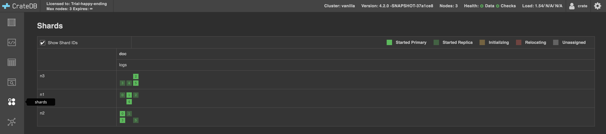

.. _scaling-down:

===========
Downscaling
===========

In this how-to guide you will:

- Create a three node cluster which will run on a single host.
- Add some data to it.
- Scale it down to a single node cluster.

.. _scaling-down-starting-vanilla-cluster:

vanilla cluster
===============

Our cluster's name is ``vanilla``, it is composed of three CrateDB nodes, all running
on the same host, and sharing the file system, operating system's scheduler, memory
manager, and hardware.

This setup provides a local cluster environment, when you only have one host, at the
cost of increased latency in writes, because when operating as a cluster, the nodes
must reach consensus on each write operation.

To set it up I recommend any of our `deployment guides`_, using this template for each
of the nodes:

::

   cluster.name: vanilla
   node.name: <NODE_NAME>
   network.host: _local_
   node.max_local_storage_nodes: 3
   stats.service.interval: 0

   http.cors.enabled: true
   http.cors.allow-origin: "*"

   transport.tcp.port: <PORT>
   gateway.expected_nodes: 3
   gateway.recover_after_nodes: 3
   discovery.seed_hosts:
       - 127.0.0.1:4301
       - 127.0.0.1:4302
       - 127.0.0.1:4303
   cluster.initial_master_nodes:
       - 127.0.0.1:4301
       - 127.0.0.1:4302
       - 127.0.0.1:4303

where ``<PORT>`` is one of ``[4301, 4302, 4303]``, and ``<NODE_NAME>`` one of ``[n1, n1, n3]``.

The settings come explained in cluster-wide-settings_ and node-specific-settings_.

Installing from sources
=======================

An alternative way of installing CrateDB is from its sources. This script summarizes
the procedure:

::

    #!/bin/sh

    # Forder 'dist' will contain the CrateDB git clone 'crate-clone'.
    # The clone will be used to build a tarball, which will be
    # cracked open. A soft link `crate` will be created to point
    # to the CrateDB distribution's root folder.

    if [ ! -d dist ]; then
        mkdir dist
    fi

    # get the clone
    if [ ! -d dist/crate-clone ]; then
        git clone https://github.com/crate/crate.git dist/crate-clone
    fi
    cd dist/crate-clone

    # delete any old tarballs
    find ./app/build/distributions -name 'crate-*.tar.gz' -exec rm -f {} \;

    # build the tarball
    git pull
    ./gradlew clean disTar

    # crack open the tarball
    latest_tar_ball=$(find ./app/build/distributions -name 'crate-*.tar.gz')
    cp $latest_tar_ball ..
    cd ..
    name=$(basename $latest_tar_ball)
    tar -xzvf $name
    rm -f $name
    name=${name/.tar.gz/}
    cd ..

    # create the symlink to the distribution folder
    rm -f crate
    ln -s dist/$name crate
    echo "Crate $name has been installed."

Once CrateDB is installed, you can create a folder ``conf`` at the same level as
the ``crate`` soft link. This folder should contain a subfolder per node, named
the same as the node ``[n1, n2, n3]``, where you can place the ``crate.yml`` file,
as well as the ``log4j2.properties`` logger configuration file (you will find a
copy inside the ``config`` folder within the CrateDB installation).

To start each node ``[n1, n2, n3]`` you can run a script (once per node) similar to:

::

    node_name=$1

    path_conf="$(pwd)/conf/$node_name"
    path_home=$(pwd)/crate
    path_data=$(pwd)/data/$node_name
    path_snapshots=$(pwd)/data/$node_name/snapshots

    export CRATE_HOME=$path_home
    if [ -z "$CRATE_HEAP_SIZE" ]; then
        export CRATE_HEAP_SIZE="8G"
    fi

    ./crate/bin/crate -Cpath.conf=$path_conf \
                      -Cpath.data=$path_data \
                      -Cpath.repo=$path_snapshots \
                      -Cnode.name=<NODE_NAME> \
                      -Ctransport.tcp.port=<PORT>

which will form the ``vanilla cluster``, electing a master.

You can interact with the cluster by opening a browser and pointing it to
*http://localhost:4200*, CrateDB's `Admin UI`_.

.. _scaling-down-adding-data:

Adding some data
================

If you would like to add some data, I recommend to follow the `generate time series data`_
tutorial, which will give you more tools and experience with CrateDB.

As an alternative, you can produce a CSV_ file **logs.csv** with a script such as:

  ::

    import random
    import string
    import ipaddress
    import time

    # to achieve log lines as in:
    #     2012-01-01T00:00:00Z,25.152.171.147,/crate/Five_Easy_Pieces.html,200,280278
    # -> timestamp
    # -> random ip address
    # -> random request (a path)
    # -> random status code
    # -> random object size

    def timestamp_range(start, end, format):
        st = int(time.mktime(time.strptime(start, format)))
        et = int(time.mktime(time.strptime(end, format)))
        dt = 1 # 1 sec
        fmt = lambda x: time.strftime(format, time.localtime(x))
        return (fmt(x) for x in range(st, et, dt))

    def rand_ip():
        return str(ipaddress.IPv4Address(random.getrandbits(32)))

    def rand_request():
        rand = lambda src: src[random.randint(0, len(src) - 1)]
        path = lambda: "/".join((rand(("usr", "bin", "workspace", "temp", "home", "crate"))) for _ in range(4))
        name = lambda: ''.join(random.sample(string.ascii_lowercase, 7))
        ext = lambda: rand(("html", "pdf", "log", "gif", "jpeg", "js"))
        return "{}/{}.{}".format(path(), name(), ext())

    def rand_object_size():
        return str(random.randint(0, 1024))

    def rand_status_code():
        return str(random.randint(100, 500))

    if __name__ == "__main__":
        print("log_time,client_ip,request,status_code,object_size")
        for ts in timestamp_range("2019-01-01T00:00:00Z", "2019-01-01T01:00:00Z", '%Y-%m-%dT%H:%M:%SZ'):
            print(",".join([ts, rand_ip(), rand_request(), rand_status_code(), rand_object_size()]))

which requires the presence of a ``logs`` table. In the `Admin UI`_:

  ::

    CREATE TABLE logs (log_time timestamp NOT NULL,
                       client_ip ip NOT NULL,
                       request string NOT NULL,
                       status_code short NOT NULL,
                       object_size long NOT NULL);

     COPY logs FROM 'file:///  logs.csv';
     REFRESH TABLE logs;
     select * from logs order by log_time limit 10800;

The three nodes perform the copy operation (remember, we are operating as a cluster),
so you are expecting to see 3600 * 3 rows inserted, of what looks like "repeated" data.
Because a primary key was not defined, CrateDB created the default *_id* primary
key for each row, and this was done at each node. The result is that each node inserted
a row per line in the csv file, with a cluster wide unique default *_id*, and this is
perceived as a triplication of the data. If you do not want to see triplication,
you can define a primary key.

.. _scaling-down-exploring-the-data:

Exploring the Data
==================

Using the `Admin UI`_, shards view on the left:

You can see the three nodes, with each having a number of shards, like so:

    +-------+---+---+---+---+---+---+
    | Shard | 0 | 1 | 2 | 3 | 4 | 5 |
    +=======+===+===+===+===+===+===+
    |  n1   | . | . | . |   | . |   |
    +-------+---+---+---+---+---+---+
    |  n2   | . | . |   | . |   | . |
    +-------+---+---+---+---+---+---+
    |  n3   |   |   | . | . | . | . |
    +-------+---+---+---+---+---+---+

Thus in this cluster setup, one node can crash; yet the data in the cluster will still
remain fully available because any two nodes have access to all the shards when they
work together to fulfill query requests. A SQL table is a composite of shards (six in
our case). When a query is executed, the planner will define steps for accessing all
the shards of the table. By adding nodes to the cluster, or shards to the table, or both,
the data is spread over more nodes, so that the computing is parallelized.

Having a look at the setup for table *logs*:

::

  SHOW CREATE TABLE logs;

Will return:

::

  CREATE TABLE IF NOT EXISTS "doc"."logs" (
     "log_time" TIMESTAMP WITH TIME ZONE NOT NULL,
     "client_ip" IP NOT NULL,
     "request" TEXT NOT NULL,
     "status_code" SMALLINT NOT NULL,
     "object_size" BIGINT NOT NULL
  )
  CLUSTERED INTO 6 SHARDS
  WITH (

     number_of_replicas = '0-1',

  )

You have a default min number of replicas of zero, and a max of one for each
of our six shards. A replica is simply a copy of a shard.

.. _scaling-down-downscaling:

Downscaling to a single node cluster
====================================

Scaling down to a single node cluster is the extreme example. In general
downscaling is achieved by making sure the surviving nodes of the cluster have
access to all the shards, even when the other nodes are missing.

The first step is to ensure that the number of replicas matches the number of
nodes, so that all nodes have access to all the shards:

::

  ALTER TABLE logs SET (number_of_replicas = '1-all');

In the `Admin UI`_, you can follow the progress of replication.

When replication is completed, you need to take down all the nodes in the cluster,
as you are going to externally affect is state by means of the crate-node-tool_. You
will first detach nodes [n2, n3], and then will bootstrap node [n1]. For convenience
here is how each operation is invoked from the command line:

::

    ./crate/bin/crate-node detach-cluster -Cpath.home=$(pwd)/crate \
                                          -Cpath.conf=$path_conf \
                                          -Cpath.data=$path_data \
                                          -Cpath.repo=$path_snapshots \
                                          -Cnode.name=<NODE_NAME> \
                                          -Ctransport.tcp.port=<PORT>

    ./crate/bin/crate-node unsafe-bootstrap -Cpath.home=$(pwd)/crate \
                                          -Cpath.conf=$path_conf \
                                          -Cpath.data=$path_data \
                                          -Cpath.repo=$path_snapshots \
                                          -Cnode.name=<NODE_NAME> \
                                          -Ctransport.tcp.port=<PORT>

The best practice is to select the node that was master in the cluster, to be the single
node in the new cluster, as then we know it had the latest version of the cluster state.
For this tutorial, we are running in a single host so the cluster state is more or less
guaranteed to be consistent across all nodes. In principle, however, the cluster could
be running across multiple hosts, and then we would want the master node to become the
new single node cluster.

The new configuration for the single node:

   ::

     cluster.name: simple   # don't really need to change this
     node.name: n1
     stats.service.interval: 0
     network.host: _local_
     node.max_local_storage_nodes: 1

     http.cors.enabled: true
     http.cors.allow-origin: "*"

     transport.tcp.port: 4301

Now you can start **n1**. The new single node cluster forms and transitions to *[YELLOW]*
state. We sort that out with:

   ::

     ALTER TABLE logs SET (number_of_replicas = '0-1');

.. _crate-howtos: https://github.com/crate/crate-howtos
.. _GitHub: https://github.com/crate/crate.git
.. _cluster-wide-settings: https://crate.io/docs/crate/reference/en/latest/config/cluster.html
.. _node-specific-settings: https://crate.io/docs/crate/reference/en/latest/config/node.html
.. _`Admin UI`: http://localhost:4200
.. _crate-node: https://crate.io/docs/crate/reference/en/latest/cli-tools.html#cli-crate-node
.. _CSV: https://en.wikipedia.org/wiki/Comma-separated_values
.. _crate-node-tool: https://crate.io/docs/crate/guide/en/latest/best-practices/crate-node.html
.. _`deployment guides` : https://crate.io/docs/crate/howtos/en/latest/deployment/index.html
.. _`generate time series data`: https://crate.io/docs/crate/tutorials/en/latest/generate-time-series/index.html