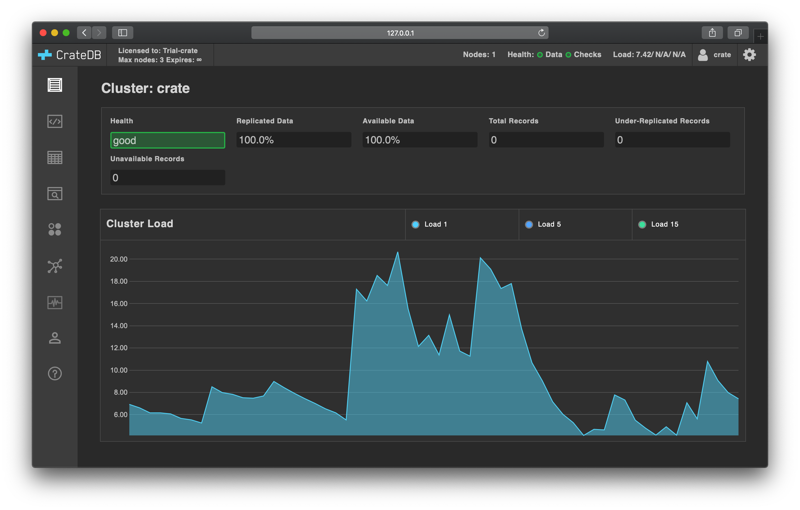

.. _use:

=========
First use
=========

Once CrateDB is :ref:`installed and running <install>`, you can start to
interact with the database for the first time.

.. rubric:: Table of contents

.. contents::
   :local:

.. _use-admin-ui:

Introducing the Admin UI
========================

CrateDB ships with a browser-based administration interface called
:ref:`Admin UI <crate-admin-ui:index>`.

The CrateDB Admin UI runs on every CrateDB node, and you can use it to inspect
and interact with the whole CrateDB cluster in a number of ways.

We will use the Admin UI throughout this section.

Access the Admin UI in your browser using a URL like this::

  http://localhost:4200/

If CrateDB is not running locally, replace ``localhost`` with the hostname
CrateDB is running on.

You should see something like this:

.. _use-crash:

Introducing the CrateDB Shell
=============================

The CrateDB Shell (aka Crash) is an interactive command-line interface (CLI)
program for working with CrateDB on your favorite terminal. For further
information about it, please follow up on its documentation at
:ref:`crate-crash:index`.

.. NOTE::

    If you are running CrateDB on a remote machine, you will have to create a
    dedicated user account for accessing the Admin UI. See :ref:`create-user`.

.. _use-more-tutorials:

Follow more tutorials to get a sense of CrateDB
===============================================

If you want to get a feel for using CrateDB to work with time series data, you
are going to need a source of time series data. Fortunately, there are many
ways to generate time series data by sampling the systems running on your local
computer.

The :ref:`next collection of tutorials <gen-ts>` shows how to generate mock
time series data about the International Space Station (ISS) and write it to
CrateDB using the client of your choice.

.. _use-start-building:

Start building with CrateDB clients and tools
=============================================

If you'd like to skip the tutorials and start building with CrateDB, you can
find a list of :ref:`crate-clients-tools:index` in a different section of the
documentation.

.. _use-dive-in:

Dive into CrateDB
=================

Check out the :ref:`crate-howtos:index` for goal oriented topics. Alternatively,
check out the :ref:`crate-reference:index` for a complete reference manual.
