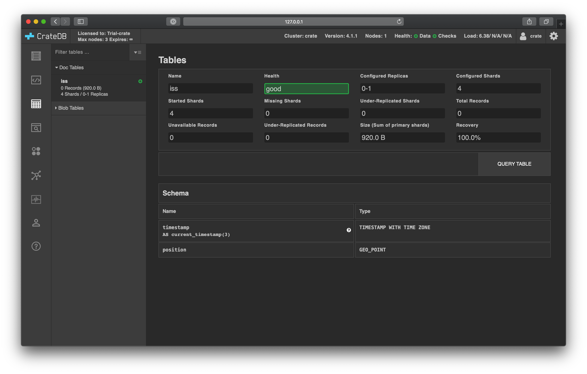

.. _gts-cli:

===============================================
Generate time series data from the command line
===============================================

This tutorial will show you how to generate :ref:`mock time series data
<gen-ts>` about the `International Space Station`_ (ISS) using the
:ref:`crate-crash:index` and a little bit of `shell scripting`_.

.. SEEALSO::

    :ref:`gen-ts`

.. rubric:: Table of contents

.. contents::
   :local:

Prerequisites
=============

CrateDB must be :ref:`installed and running <install>`.

Crash is available as `pip`_ package. :ref:`Install <crate-crash:getting-started>` it
like this:

.. code-block:: console

    sh$ pip install crash

We have designed the commands in this tutorial to be run directly from the
`command line`_ so that you can experiment with them as you see fit.

You will need the `curl`_ and `jq`_ tools installed.

.. NOTE::

    This tutorial should work in most POSIX-compatible environments (e.g.,
    Linux, macOS, and Windows Cygwin). Please `let us know`_ if you run into
    issues.

Get the current position of the ISS
====================================

`Open Notify`_ is a third-party service that provides an API to consume data
about the current position, or `ground point`_, of the ISS.

The endpoint for this API is `<http://api.open-notify.org/iss-now.json>`_.

You can query this endpoint using ``curl``:

.. code-block:: console

    sh$ curl -s -w "\n" http://api.open-notify.org/iss-now.json

    {"message": "success", "iss_position": {"latitude": "23.1703", "longitude": "-105.4034"}, "timestamp": 1590394500}

As shown, the endpoint returns a JSON payload, which contains an
``iss_position`` object with ``latitude`` and ``longitude`` data.

Parse the ISS position
=======================

The ``jq`` command is a convenient tool to parse JSON payloads on the command
line. You can use the ``|`` character to `pipe`_ the output from ``curl`` into
``jq`` for processing.

For example, to return the whole payload, do this:

.. code-block:: console

    sh$ curl -s http://api.open-notify.org/iss-now.json | jq '.'

    {
      "message": "success",
      "iss_position": {
        "latitude": "21.9711",
        "longitude": "-104.3298"
      },
      "timestamp": 1590394525
    }

The most useful information is the latitude and longitude coordinates. You can
use ``jq`` with a filter to isolate those data points:

.. code-block:: console

    sh$ curl -s http://api.open-notify.org/iss-now.json | \
            jq -r '[.iss_position.longitude, .iss_position.latitude] | @tsv'

    -103.4015    20.9089

You can encapsulate this command with a `shell function`_:

.. code-block:: console

    sh$ position () { \
            curl -s http://api.open-notify.org/iss-now.json | \
                jq -r '[.iss_position.longitude, .iss_position.latitude] | @tsv'; \
        }

Now, when you want the position, run ``position``:

.. code-block:: console

    sh$ position

    -102.3230    19.6460

To insert these values into an SQL query, you need to format them into a `WKT`_
string, like so:

.. code-block:: console

    sh$ echo "POINT ($(position | expand -t 1))"

    POINT (-101.2633 18.3756)

Encapsulate this command with a function:

.. code-block:: console

    sh$ wkt_position () { \
            echo "POINT ($(position | expand -t 1))"; \
        }

Which you can now call using ``wkt_position``:

.. code-block:: console

    sh$ wkt_position

    POINT (-96.4784 12.3053)

Set up CrateDB
==============

Start an interactive Crash session:

.. code-block:: console

    sh$ crash --hosts localhost:4200

.. NOTE::

    You can omit the ``--hosts`` argument if CrateDB is running on
    ``localhost:4200``. We have included it here for the sake of clarity.
    Modify the argument if you wish to connect to a CrateDB node on a different
    host or port number.

Then, :ref:`create a table <crate-reference:ddl-create-table>` suitable for writing
load averages.

.. code-block:: psql

    cr> CREATE TABLE iss (
            timestamp TIMESTAMP GENERATED ALWAYS AS CURRENT_TIMESTAMP,
            position GEO_POINT
        );

    CREATE OK, 1 row affected  (0.726 sec)

In the :ref:`crate-admin-ui:index`, you should see the new table when you navigate
to the *Tables* screen using the left-hand navigation menu:

Record the ISS position
=======================

With the table in place, you can start recording the position of the ISS.

Crash provides a non-interactive mode that you can use to execute SQL
statements directly from the command line.

First, exit from the interactive Crash session (or open a new terminal). Then,
use ``crash`` with the ``--command`` argument to execute an :ref:`INSERT
<crate-reference:dml-inserting-data>` query.

.. code-block:: console

    sh$ crash --hosts localhost:4200 \
            --command "INSERT INTO iss (position) VALUES ('$(wkt_position)')"

    CONNECT OK
    INSERT OK, 1 row affected  (0.037 sec)

.. WARNING::

    For any real-world application, you must always sanitize your data before
    interpolating it into an SQL query.

Press the up arrow on your keyboard and hit *Enter* to run the same command a
few more times.

When you're done, you can :ref:`select <crate-reference:sql_dql_queries>` that data
back out of CrateDB.

.. code-block:: console

    sh$ crash --hosts localhost:4200 \
            --command 'SELECT * FROM iss ORDER BY timestamp DESC'

    +---------------+---------------------+
    |     timestamp | position            |
    +---------------+---------------------+
    | 1590395103748 | [-82.6328, -6.9134] |
    | 1590395102176 | [-82.6876, -6.8376] |
    | 1590395018584 | [-85.7139, -2.6095] |
    +---------------+---------------------+
    SELECT 3 rows in set (0.105 sec)

Here you have recorded three sets of ISS position coordinates.

Automate the process
====================

Now you have key components, you can automate the data collection.

Create a file named ``iss-position.sh``, like this:

.. code-block:: sh

    # Exit immediately if a pipeline returns a non-zero status
    set -e

    position () {
        curl -s http://api.open-notify.org/iss-now.json |
            jq -r '[.iss_position.longitude, .iss_position.latitude] | @tsv';
    }

    wkt_position () {
        echo "POINT ($(position | expand -t 1))";
    }

    while true; do
        crash --hosts localhost:4200 \
            --command "INSERT INTO iss (position) VALUES ('$(wkt_position)')"
        echo 'Sleeping for 10 seconds...'
        sleep 10
    done

Here, the script sleeps for 10 seconds after each sample. Accordingly, the time
series data will have a *resolution* of 10 seconds. You may want to configure
your script differently.

Run it from the command line, like so:

.. code-block:: console

    $ sh iss-position.sh

    CONNECT OK
    INSERT OK, 1 row affected  (0.029 sec)
    Sleeping for 10 seconds...
    CONNECT OK
    INSERT OK, 1 row affected  (0.033 sec)
    Sleeping for 10 seconds...
    CONNECT OK
    INSERT OK, 1 row affected  (0.038 sec)
    Sleeping for 10 seconds...

As this runs, you should see the table filling up in the CrateDB Admin UI:

.. image:: ../_assets/img/generate-time-series/rows.png

Lots of freshly generated time series data, ready for use.

And, for bonus points, if you select the arrow next to the location data, it
will open up a map view showing the current position of the ISS:

.. image:: ../_assets/img/generate-time-series/map.png

.. TIP::

    The ISS passes over large bodies of water. If the map looks empty, try
    zooming out.

.. _command line: https://en.wikipedia.org/wiki/Command-line_interface
.. _curl: https://curl.se/
.. _data sanitization: https://xkcd.com/327/
.. _ground point: https://en.wikipedia.org/wiki/Ground_track
.. _International Space Station: https://www.nasa.gov/mission_pages/station/main/index.html
.. _jq: https://stedolan.github.io/jq/
.. _let us know: https://github.com/crate/crate-tutorials/issues/new
.. _open notify: http://open-notify.org/
.. _pip: https://pypi.org/project/pip/
.. _pipe: https://www.geeksforgeeks.org/piping-in-unix-or-linux/
.. _shell function: https://www.gnu.org/software/bash/manual/html_node/Shell-Functions.html
.. _shell scripting: https://en.wikipedia.org/wiki/Shell_script
.. _WKT: https://en.wikipedia.org/wiki/Well-known_text_representation_of_geometry
