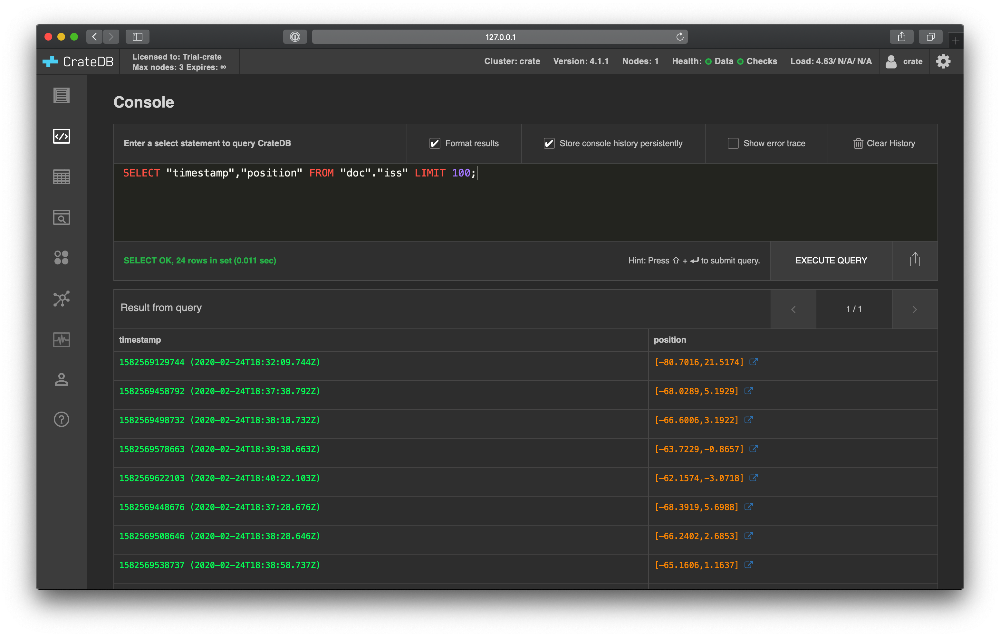
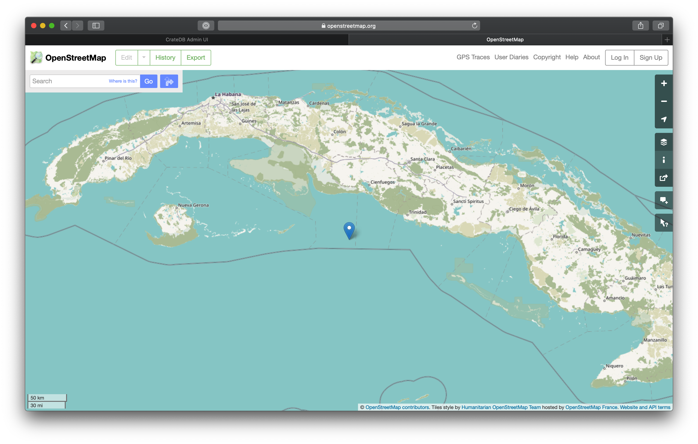

.. _gen-ts-go:

==================================
Generate time series data using Go
==================================

This tutorial will show you how to generate some :ref:`mock time series data
<gen-ts>` about the `International Space Station`_ (ISS) using `Go`_.

.. SEEALSO::

    :ref:`gen-ts`

.. rubric:: Table of contents

.. contents::
   :local:

Prerequisites
=============

CrateDB must be :ref:`installed and running <install>`.

Make sure you are running an up-to-date version of `Go`_. We recommend Go 1.11
or higher since you will be making use of `modules`_.

Most of this tutorial is designed to be run as a local project using Go
tooling since the `compilation`_ unit is the package and not a single line.

To begin, create a project directory and navigate into it:

.. code-block:: console

    sh$ mkdir time-series-go
    sh$ cd time-series-go

Next, choose a module path and create a ``go.mod`` file that declares it. A
module is a collection of Go packages stored in a file hierarchy with a
``go.mod`` file at the root. This file defines the module’s module path, which
is also the import path for the root directory and its dependency requirements.

Without a ``go.mod`` file, your project contains a package, but no module and
the ``go`` command will make up a fake import path based on the directory name.

Make the current directory the root of a module by using the
``go mod init`` command to create a ``go.mod`` file there:

.. code-block:: console

    sh$ go mod init example.com/time-series-go

You should see a ``go.mod`` file in the current directory with contents similar
to:

.. code-block:: console

    module example.com/time-series-go

    go 1.14

Next, create a file named ``main.go`` in the same directory:

.. code-block:: console

   sh$ touch main.go

Open this file in your favorite code editor.

Get the current position of the ISS
===================================

`Open Notify`_ is a third-party service that provides an API to consume data
about the current position, or `ground point`_, of the ISS.

The endpoint for this API is `<http://api.open-notify.org/iss-now.json>`_.

In the ``main.go`` file, declare the main package at the top (to tell the
compiler that the program is an executable) and import some packages from the
`standard library`_ that will be used in this tutorial. Declare a main
function which will be the entry point of the executable program:

.. code-block:: go

    package main

    import (
        "encoding/json"
        "fmt"
        "io/ioutil"
        "log"
        "net/http"
    )

    func main() {

    }

Then, read the current position of the ISS by going to the Open Notify API
endpoint at `<http://api.open-notify.org/iss-now.json>`_ in your browser.

.. code-block:: go

   {
        "message":"success",
        "timestamp":1591703638,
        "iss_position":{
            "longitude":"84.9504",
            "latitude":"41.6582"
        }
    }

As shown, the endpoint returns a JSON payload, which contains an
``iss_position`` object with ``latitude`` and ``longitude`` data.

Parse the ISS position
=======================

To parse the JSON payload, you can create a `struct`_ to `unmarshal`_ the data
into. When you unmarshal JSON into a struct, the function matches incoming
object keys to the keys in the struct field name or its tag. By default, object
keys which don't have a corresponding struct field are ignored.

.. code-block:: go

    type issInfo struct {
        IssPosition struct {
            Longitude string `json:"longitude"`
            Latitude  string `json:"latitude"`
        } `json:"iss_position"`
    }

Now, create a function that makes an HTTP GET request to the Open Notify API
endpoint and returns longitude and latitude as a
:ref:`crate-reference:data-types-geo` declaration.

.. code-block:: go

    func getISSPosition() (string, error) {
        var i issInfo

        response, err := http.Get("http://api.open-notify.org/iss-now.json")
        if err != nil {
            return "", fmt.Errorf("unable to retrieve request: %v", err)
        }
        defer response.Body.Close()

        if response.StatusCode/100 != 2 {
            return "", fmt.Errorf("bad response status: %s", response.Status)
        }

        responseData, err := ioutil.ReadAll(response.Body)
        if err != nil {
            return "", fmt.Errorf("unable to read response body: %v", err)
        }

        err = json.Unmarshal(responseData, &i)
        if err != nil {
            return "", fmt.Errorf("unable to unmarshal response body: %v", err)
        }

        s := fmt.Sprintf("(%s, %s)", i.IssPosition.Longitude, i.IssPosition.Latitude)
        return s, nil
    }

Above, the ``getISSPosition()`` function:

.. rst-class:: open

 * Uses the `net/http`_ package from the Go standard library to issue an
   HTTP GET request to the API endpoint

 * Implements some basic error handling and checks to see whether the
   response code is in the 200 range

 * Reads the response body and unmarshals the JSON into the defined
   struct ``issInfo``

 * Formats the return string and returns it

Then in the main function, call the ``getISSPosition()`` function and print
out the result:

.. code-block:: go

    func main() {
        pos, err := getISSPosition()
        if err != nil {
            log.Fatal(err)
        }

        fmt.Println(pos)
    }

Save your changes and run the code:

.. code-block:: console

    sh$ go run main.go

The result should contain your geo_point string:

.. code-block:: go

    (104.7298, 5.0335)

You can run this multiple times to get the new position of the ISS each time.

Set up CrateDB
==============

First, import the `context`_ package from the standard library and the `pgx`_
client:

.. code-block:: go

    import (
        "context"
        "encoding/json"
        "flag"
        "fmt"
        "io/ioutil"
        "log"
        "net/http"

        "github.com/jackc/pgx/v4"
    )

Then, in your main function, connect to CrateDB using the
:ref:`crate-reference:interface-postgresql` port (``5432``) and
:ref:`create a table <crate-reference:ddl-create-table>` suitable for writing ISS
position coordinates.

.. code-block:: go

    var conn *pgx.Conn

    func main() {
        var err error
        conn, err = pgx.Connect(context.Background(), "postgresql://crate@localhost:5432/doc")
        if err != nil {
            log.Fatalf("unable to connect to database: %v\n", err)
        } else {
            fmt.Println("CONNECT OK")
        }
        defer conn.Close(context.Background())

        conn.Exec(context.Background(),
            "CREATE TABLE [ IF NOT EXISTS ] iss (
                timestamp TIMESTAMP GENERATED ALWAYS AS CURRENT_TIMESTAMP,
                position GEO_POINT
            )")
    }

Save your changes and run the code:

.. code-block:: console

    sh$ go run main.go

When you run the script this time, the ``go`` command will look up the module
containing the `pgx`_ package and add it to ``go.mod``.

In the :ref:`crate-admin-ui:index`, you should see the new table when you navigate
to the *Tables* screen using the left-hand navigation menu:

.. image:: ../_assets/img/generate-time-series/table.png

Record the ISS position
=======================

With the table in place, you can start recording the position of the ISS.

Create some logic that calls your ``getISSPosition`` function and :ref:`insert
<crate-reference:dml-inserting-data>` the result into the ``iss`` table.

.. code-block:: go

    ...

    func main() {
        ...

        pos, err := getISSPosition()
        if err != nil {
            log.Fatalf("unable to get ISS position: %v\n", err)
        } else {
            _, err := conn.Exec(context.Background(),
                "INSERT INTO iss (position) VALUES ($1)", pos)
            if err != nil {
                log.Fatalf("unable to insert data: %v\n", err)
            } else {
                fmt.Println("INSERT OK")
            }
        }
    }

Save your changes and run the code:

.. code-block:: console

    sh$ go run main.go

Press the up arrow on your keyboard and hit *Enter* to run the same command a
few more times.

When you're done, you can :ref:`select <crate-reference:sql_dql_queries>` that data
back out of CrateDB with this query:

.. code-block:: psql

    SELECT * FROM "doc"."iss"

.. TIP::

    You can run ad-hoc SQL queries directly from the *Console* screen in the
    Admin UI. You can navigate to the console from the left-hand navigation
    menu, as before.

Automate the process
====================

Now that you have the key components, you can automate the data collection.

In your file ``main.go``, create a function that encapsulates data insertion:

.. code-block:: go

    func insertData(position string) error {
        _, err := conn.Exec(context.Background(),
            "INSERT INTO iss (position) VALUES ($1)", position)
        return err
    }

Then in the script's ``main`` function, create an infinite loop that gets the
latest ISS position and inserts the data into the database.

.. code-block:: go

    ...

    func main() {
        ...

        for {
            pos, err := getISSPosition()
            if err != nil {
                log.Fatalf("unable to get ISS position: %v\n", err)
            } else {
                err = insertData(pos)
                if err != nil {
                    log.Fatalf("unable to insert data: %v\n", err)
                } else {
                    fmt.Println("INSERT OK")
                }
            }
            fmt.Println("Sleeping for 10 seconds...")
            time.Tick(time.Second * 10)
	    }
    }

.. SEEALSO::

    `The completed script source`_

Above, the ``main()`` function:

.. rst-class:: open

 * Retrieves the latest ISS position through the ``getISSPosition()`` function

 * Inserts the ISS position into CrateDB through the ``insertData()`` function

 * Implements some basic error handling, in case either the API query or the
   CrateDB operation fails

 * Sleeps for 10 seconds after each sample using the `time`_ package

Accordingly, the time series data will have a *resolution* of 10 seconds. If
you wish to change this resolution, you may want to configure your script
differently.

Run the script from the command line:

.. code-block:: console

    $ go run main.go

    INSERT OK
    Sleeping for 10 seconds...
    INSERT OK
    Sleeping for 10 seconds...
    INSERT OK
    Sleeping for 10 seconds...

As the script runs, you should see the table filling up in the
:ref:`crate-admin-ui:index`.

Lots of freshly generated time series data, ready for use.

And, for bonus points, if you select the arrow next to the location data, it
will open up a map view showing the current position of the ISS:

.. TIP::

    The ISS passes over large bodies of water. If the map looks empty, try
    zooming out.

.. _compilation: https://www.geeksforgeeks.org/difference-between-compiled-and-interpreted-language/
.. _context: https://golang.org/pkg/context/
.. _Go: https://golang.org/
.. _ground point: https://en.wikipedia.org/wiki/Ground_track
.. _International Space Station: https://www.nasa.gov/mission_pages/station/main/index.html
.. _modules: https://blog.golang.org/migrating-to-go-modules
.. _net/http: https://golang.org/pkg/net/http/
.. _open notify: http://open-notify.org/
.. _pgx: https://github.com/jackc/pgx/tree/v4
.. _standard library: https://golang.org/pkg/
.. _struct: https://golang.org/ref/spec#Struct_types
.. _The completed script source: https://play.golang.org/p/2HoBzpBn-iF
.. _time: https://golang.org/pkg/time/
.. _unmarshal: https://pkg.go.dev/encoding/json#Unmarshal
