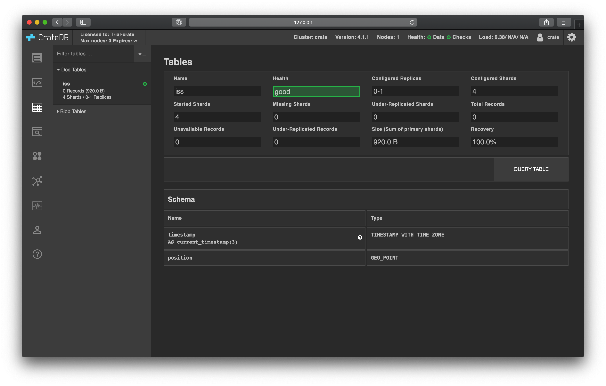
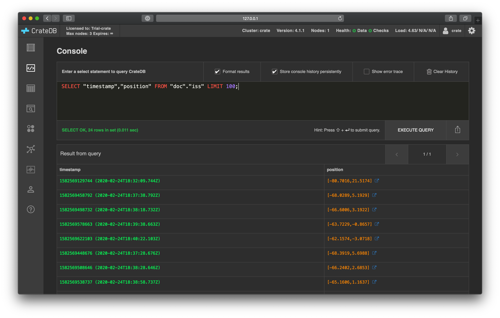
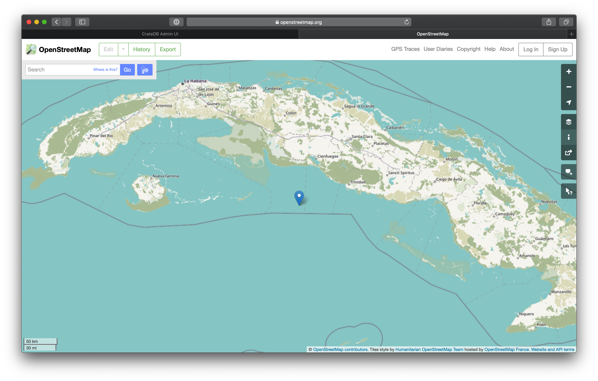

.. _gts-python:

======================================
Generate time series data using Python
======================================

This tutorial will show you how to generate :ref:`mock time series data
<gen-ts>` about the `International Space Station`_ (ISS) using `Python`_.

.. SEEALSO::

    :ref:`gen-ts`

.. rubric:: Table of contents

.. contents::
   :local:

Prerequisites
=============

CrateDB must be :ref:`installed and running <install>`.

Make sure you're running an up-to-date version of Python (we recommend 3.7 or
higher).

Then, use `pip`_ to install the `requests`_ and  :ref:`crate-python:index` libraries:

.. code-block:: console

    sh$ pip install requests crate

The rest of this tutorial is designed for Python's `interactive mode`_ so that
you can experiment with the commands as you see fit. The `standard
Python interpreter`_ works fine for this, but we recommend `IPython`_ for a more
user-friendly experience.

You can install IPython with Pip:

.. code-block:: console

    sh$ pip install ipython

Once installed, you can start an interactive IPython session like this:

.. code-block:: console

    sh$ ipython

Get the current position of the ISS
====================================

`Open Notify`_ is a third-party service that provides an API to consume data
about the current position, or `ground point`_, of the ISS.

The endpoint for this API is `<http://api.open-notify.org/iss-now.json>`_.

Start an interactive Python session (as above).

Next, import the `requests`_ library::

    >>> import requests

Then, read the current position of the ISS with an HTTP GET request to the Open
Notify API endpoint, like this:

    >>> response = requests.get("http://api.open-notify.org/iss-now.json")
    >>> response.json()
    {'message': 'success',
     'timestamp': 1582730500,
     'iss_position': {'latitude': '33.3581', 'longitude': '-57.3929'}}

As shown, the endpoint returns a JSON payload, which contains an
``iss_position`` object with ``latitude`` and ``longitude`` data.

You can encapsulate this operation with a function that returns longitude and
latitude as a `WKT`_ string:

    >>> def position():
    ...     response = requests.get("http://api.open-notify.org/iss-now.json")
    ...     position = response.json()["iss_position"]
    ...     return f'POINT ({position["longitude"]} {position["latitude"]})'

When you run this function, it should return your point string::

    >>> position()
    'POINT (-30.9188 42.8036)'

Set up CrateDB
==============

First, import the :ref:`crate-python:index` client:

    >>> from crate import client

Then, :ref:`crate-python:connect`:

    >>> connection = client.connect("localhost:4200")

.. NOTE::

    You can omit the function argument if CrateDB is running on
    ``localhost:4200``. We have included it here for the sake of clarity.
    Modify the argument if you wish to connect to a CrateDB node on a different
    host or port number.

Get a :ref:`cursor <crate-python:cursor>`:

    >>>  cursor = connection.cursor()

Finally, :ref:`create a table <crate-reference:ddl-create-table>` suitable for writing
ISS position coordinates.

    >>> cursor.execute(
    ...     """CREATE TABLE iss (
    ...            timestamp TIMESTAMP GENERATED ALWAYS AS CURRENT_TIMESTAMP,
    ...            position GEO_POINT)"""
    ... )

In the :ref:`crate-admin-ui:index`, you should see the new table when you navigate to
the *Tables* screen using the left-hand navigation menu:

Record the ISS position
=======================

With the table in place, you can start recording the position of the ISS.

The following command calls your ``position`` function and will :ref:`insert
<crate-reference:dml-inserting-data>` the result into the ``iss`` table:

    >>> cursor.execute("INSERT INTO iss (position) VALUES (?)", [position()])

Press the up arrow on your keyboard and hit *Enter* to run the same command a
few more times.

When you're done, you can :ref:`select <crate-reference:sql_dql_queries>` that data
back out of CrateDB.

    >>> cursor.execute('SELECT * FROM iss ORDER BY timestamp DESC')

Then, :ref:`fetch all <crate-python:fetchall>` the result rows at once:

    >>> cursor.fetchall()
    [[1582295967721, [-8.0689, 25.8967]],
     [1582295966383, [-8.1371, 25.967]],
     [1582295926523, [-9.9662, 27.8032]]]

Here you have recorded three sets of ISS position coordinates.

Automate the process
====================

Now you have key components, you can automate the data collection.

Create a new file called ``iss-position.py``, like this:

.. code-block:: python

    import time

    import requests
    from crate import client

    def position():
        response = requests.get("http://api.open-notify.org/iss-now.json")
        position = response.json()["iss_position"]
        return f'POINT ({position["longitude"]} {position["latitude"]})'

    def insert():
        # New connection each time
        try:
            connection = client.connect("localhost:4200")
            print("CONNECT OK")
        except Exception as err:
            print("CONNECT ERROR: %s" % err)
            return
        cursor = connection.cursor()
        try:
            cursor.execute(
                "INSERT INTO iss (position) VALUES (?)", [position()],
            )
            print("INSERT OK")
        except Exception as err:
            print("INSERT ERROR: %s" % err)
            return

    # Loop indefinitely
    while True:
        insert()
        print("Sleeping for 10 seconds...")
        time.sleep(10)

Here, the script sleeps for 10 seconds after each sample. Accordingly, the time
series data will have a *resolution* of 10 seconds. You may want to configure
your script differently.

Run the script from the command line, like so:

.. code-block:: console

    sh$ python iss-position.py
    CONNECT OK
    INSERT OK
    Sleeping for 10 seconds...
    CONNECT OK
    INSERT OK
    Sleeping for 10 seconds...
    CONNECT OK
    INSERT OK
    Sleeping for 10 seconds...

As the script runs, you should see the table filling up in the CrateDB Admin
UI:

Lots of freshly generated time series data, ready for use.

And, for bonus points, if you select the arrow next to the location data, it
will open up a map view showing the current position of the ISS:

.. TIP::

    The ISS passes over large bodies of water. If the map looks empty, try
    zooming out.

.. _ground point: https://en.wikipedia.org/wiki/Ground_track
.. _interactive mode: https://docs.python.org/3/tutorial/interpreter.html#interactive-mode
.. _International Space Station: https://www.nasa.gov/mission_pages/station/main/index.html
.. _IPython: https://ipython.org/
.. _open notify: http://open-notify.org/
.. _pip: https://pypi.org/project/pip/
.. _Python: https://www.python.org/
.. _requests: https://requests.readthedocs.io/en/latest/
.. _standard Python interpreter: https://docs.python.org/3/tutorial/interpreter.html
.. _WKT: https://en.wikipedia.org/wiki/Well-known_text_representation_of_geometry
