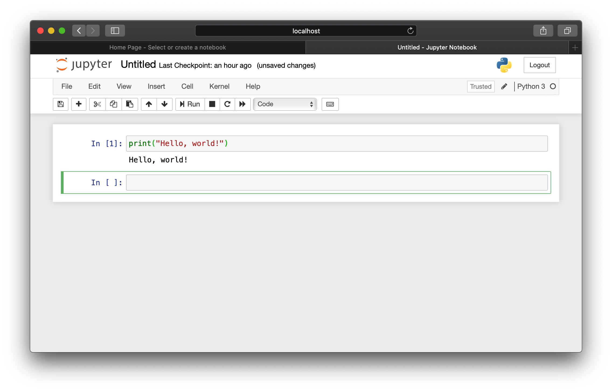
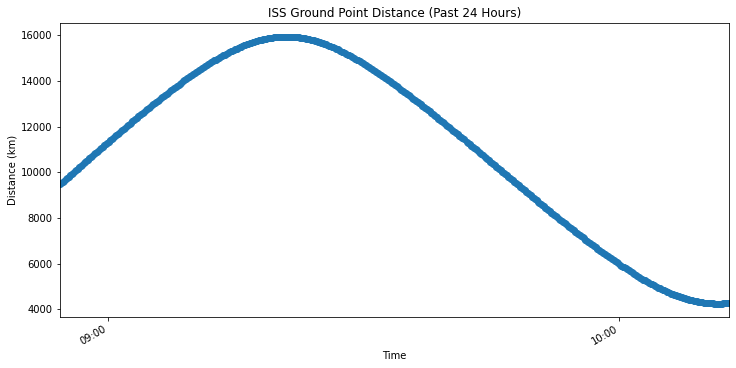
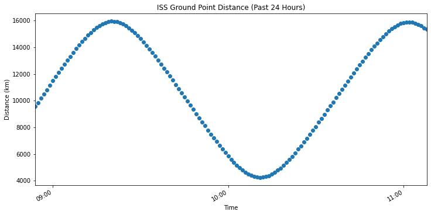
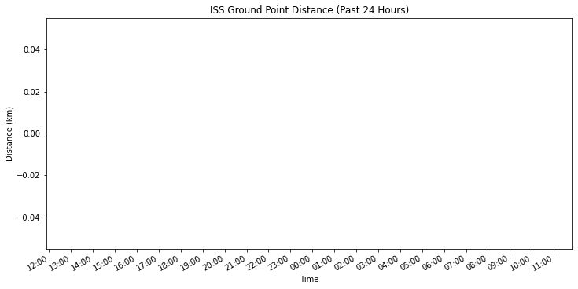
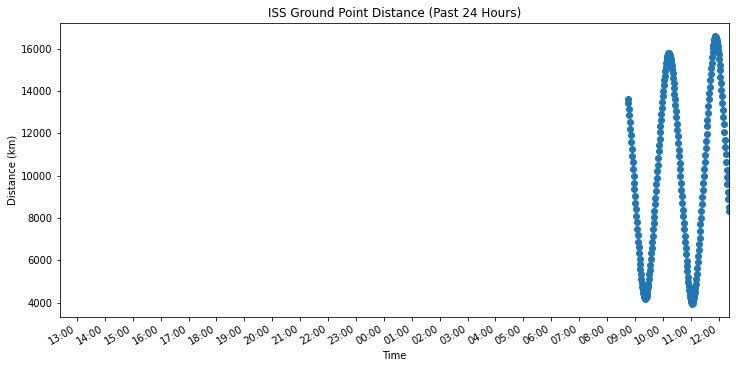
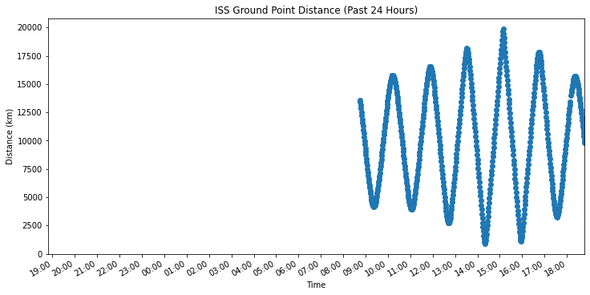

.. _normalize-intervals:

====================================
Normalize time series data intervals
====================================

.. sidebar:: The ISS Orbit

    .. image:: _assets/img/normalize-intervals/orbit.gif
        :alt: An animated visualization of the ISS orbit
        :target: https://en.wikipedia.org/wiki/International_Space_Station#Orbit

    The ISS travels at 27,724 kilometers per hour and orbits Earth
    approximately once every 90 minutes.

If you followed one of the tutorials in the :ref:`previous section <gen-ts>`,
you should have some mock time series data about the position, or `ground
point`_, of the `International Space Station`_ (ISS).

It is common to visualize time series data by graphing values over time.
However, you may run into the following issues:

1. The resolution of your data does not match the resolution you want for your
   visualization.

   *For example, you want to plot a single value per minute, but your data is
   spaced in 10-second intervals. You will need to resample the data.*

2. Your data is non-continuous, but you want to visualize a continuous time
   series.

   *For example, you want to plot every minute for the past 24 hours, but you
   are missing data for some intervals. You will need to fill in the missing
   values.*

This tutorial demonstrates the shortcomings of visualizing the non-normalized
data and shows you how to address these shortcomings by normalizing your data
using SQL.

.. NOTE::

    This tutorial focuses on the use of SQL. Code examples demonstrate the use
    of the CrateDB Python client. However, the following guidelines will work
    with any language that allows for the execution of SQL.

.. SEEALSO::

    :ref:`Tutorials for generating mock time series data <gen-ts>`

.. rubric:: Table of contents

.. contents::
   :local:

.. _ni-prereq:

Prerequisites
=============

.. _ni-mock-data:

Mock data
---------

You must have CrateDB :ref:`installed and running <install>`.

This tutorial works with ISS location data. Before continuing, you should have
generated some ISS data by following one of the tutorials in the :ref:`previous
section <gen-ts>`.

.. _ni-python:

Python setup
------------

You should be using the latest stable version of `Python`_.

You must have the following Python libraries installed:

- `pandas`_ -- querying and data manipulation
- `SQLAlchemy`_ -- a powerful database abstraction layer
- The :ref:`crate-python:index` -- SQLAlchemy support for CrateDB
- `Matplotlib`_ -- data visualization
- `geojson`_ -- Functions for encoding and decoding GeoJSON formatted data

You can install (or upgrade) the necessary libraries with `Pip`_:

.. code-block:: console

    sh$ pip3 install --upgrade pandas sqlalchemy crate matplotlib geojson

.. _ni-jupyter:

Using Jupyter Notebook
~~~~~~~~~~~~~~~~~~~~~~

This tutorial shows you how to use `Jupyter Notebook`_ so that you can display
data visually and experiment with the commands as you see fit.

Jupyter Notebook allows you to create and share documents containing live code,
equations, visualizations, and narrative text.

You can install Jupyter with Pip:

.. code-block:: console

    sh$ pip3 install --upgrade notebook

Once installed, you can start a new Jupyter Notebook session, like this:

.. code-block:: console

    sh$ jupyter notebook

This command should open a new browser window. In this window, select *New* (in
the top right-hand corner), then *Notebook* → *Python 3*.

Type your Python code at the input prompt. Then, select *Run* (Shift-Enter ⇧⏎)
to evaluate the code:

You can re-evaluate input blocks as many times as you like.

.. SEEALSO::

    `Jupyter Notebook basics`_

.. _ni-alt-shells:

Alternative shells
~~~~~~~~~~~~~~~~~~

Jupyter mimics Python's `interactive mode`_.

If you're more comfortable in a text-based environment, you can use the
`standard Python interpreter`_. However, we recommend `IPython`_ (the kernel
used by Jupyter) for a more user-friendly experience.

You can install IPython with Pip:

.. code-block:: console

    sh$ pip3 install --upgrade ipython

Once installed, you can start an interactive IPython session like this:

.. code-block:: console

    sh$ ipython

    Python 3.9.10 (main, Jan 15 2022, 11:48:04)
    Type 'copyright', 'credits' or 'license' for more information
    IPython 8.0.1 -- An enhanced Interactive Python. Type '?' for help.

    In [1]:

.. _ni-steps:

Steps
=====

To follow along with this tutorial, copy and paste the example Python code into
Jupyter Notebook and evaluate the input one block at a time.

.. _ni-query-raw:

Query the raw data
------------------

This tutorial uses `pandas`_ to query CrateDB and manipulate the results.

To get started, import the ``pandas`` library:

.. code-block:: python

    import pandas

Pandas uses `SQLAlchemy`_ and the :ref:`crate-python:index` to provide support
for ``crate://`` style :ref:`connection strings <crate-python:database-urls>`.

Then, query the raw data:

.. code-block:: python

    pandas.read_sql('SELECT * FROM doc.iss', 'crate://localhost:4200')

.. NOTE::

    By default, CrateDB binds to port ``4200`` on ``localhost``.

    Edit the connection string as needed.

If you evaluate the :py:func:`read_sql() <pandas.read_sql>` call above, the
Jupyter notebook should eventually display a table like this:

.. csv-table::
    :header: "", "timestamp", "position"
    :widths: auto

    "0", "1591865682133", "[144.0427, 22.7383]"
    "1", "1591865702975", "[144.9187, 21.7528]"
    "2", "1591865775973", "[147.9357, 18.2015]"
    "3", "1591865818387", "[149.6088, 16.1326]"
    "4", "1591865849756", "[150.8377, 14.5709]"
    "…", "…", "…"
    "59", "1591866131684", "[161.2033, 0.4045]"
    "60", "1591866236187", "[164.9696, -4.896]"
    "61", "1591866016657", "[157.0666, 6.21]"
    "62", "1591866267764", "[166.1145, -6.4896]"
    "63", "1591866278210", "[166.4979, -7.0202]"

Here are a few ways to improve this result:

.. rst-class:: open

 * The current query returns all data. At first, this is probably okay for
   visualization purposes. However, as you generate more data, you will probably
   find it more useful to limit the results to a specific time window.

 * The ``timestamp`` column isn't human-readable. It would be easier to
   understand the results if this value was as a human-readable time.

 * The ``position`` column is a :ref:`crate-reference:data-types-geo`. This data
   type isn't easy to plot on a traditional graph. However, you can use the
   :ref:`distance() <crate-reference:scalar-distance>` function to calculate the
   distance between two ``geo_point`` values. If you compare ``position`` to a
   fixed place, you can plot distance over time for a graph showing you how far
   away the ISS is from some location of interest.

Here's an improvement that wraps the code in a function named ``raw_data()`` so
that you can execute this query multiple times:

.. code-block:: python

    import pandas

    def raw_data():
        # From <https://www.latlong.net/>
        berlin_position = [52.520008, 13.404954]
        # Returns distance in kilometers (division by 1000)
        sql = f'''
            SELECT iss.timestamp AS time,
                   DISTANCE(iss.position, {berlin_position}) / 1000 AS distance
            FROM doc.iss
            WHERE iss.timestamp >= CURRENT_TIMESTAMP - INTERVAL '1' DAY
            ORDER BY time ASC
        '''
        return pandas.read_sql(sql, 'crate://localhost:4200', parse_dates={'time': 'ms'})

Specifically:

.. rst-class:: open

 * You can define the `location`_ of Berlin and interpolate that into the query
   to calculate the ``DISTANCE()`` of the ISS ground point in kilometers.

 * You can use :ref:`CURRENT_TIMESTAMP <crate-reference:scalar-current_timestamp>` with an
   interval :ref:`value expression <crate-reference:sql-value-expressions>`
   (``INTERVAL '1' DAY``) to calculate a timestamp that is 24 hours in the
   past. You can then use a :ref:`WHERE clause <crate-reference:sql-select-where>`
   to filter out records with a ``timestamp`` older than one day.

   An :ref:`ORDER BY clause <crate-reference:sql-select-order-by>` sorts the results
   by ``timestamp``, oldest first.

 * You can use the ``parse_dates`` argument to specify which columns
   ``read_sql()`` should parse as datetimes. Here, a dictionary with the value
   of ``ms`` is used to specify that ``time`` is a millisecond integer.

Execute the ``raw_data()`` function:

.. code-block:: python

    raw_data()

Jupyter should display a table like this:

.. csv-table::
    :header: "", "time", "distance"
    :widths: auto

    "0", "2020-06-11 08:54:21.153", "9472.748594"
    "1", "2020-06-11 08:54:31.675", "9530.500793"
    "2", "2020-06-11 08:54:42.133", "9588.243498"
    "3", "2020-06-11 08:54:52.559", "9643.233027"
    "4", "2020-06-11 08:55:02.975", "9700.967306"
    "…", "…", "…"
    "444", "2020-06-11 10:11:51.812", "4249.557635"
    "445", "2020-06-11 10:12:02.273", "4251.786695"
    "446", "2020-06-11 10:12:12.698", "4254.968453"
    "447", "2020-06-11 10:12:23.147", "4259.121566"
    "448", "2020-06-11 10:12:33.699", "4264.223073"

Above, notice the query used by the ``raw_data()`` function produces:

 * Fewer rows than the previous query (limited by the 24 hour time window)

 * A human-readable time (instead of a timestamp)

 * The distance of the ISS ground point in kilometers (instead of a
   ``geo_point`` object)

.. _ni-plot:

Plot the data
-------------

You can plot the data returned by the previous query using `Matplotlib`_.

Here's an example function that plots the data:

.. code-block:: python

    import matplotlib.pyplot as plt
    import matplotlib.dates as mdates

    def plot(data):
        fig, ax = plt.subplots(figsize=(12, 6))
        ax.scatter(data['time'], data['distance'])
        ax.set(
            xlabel='Time',
            ylabel='Distance (km)',
            title='ISS Ground Point Distance (Past 24 Hours)')
        ax.xaxis_date()
        ax.xaxis.set_major_locator(mdates.HourLocator())
        ax.xaxis.set_major_formatter(mdates.DateFormatter('%H:00'))
        # Plot the whole date range (null time values are trimmed by default)
        ax.set_xlim(data.min()['time'], data.max()['time'])
        fig.autofmt_xdate()

Above, the ``plot()`` function:

 * Generates a :py:func:`figure <matplotlib.pyplot.figure>` that measures 12 × 6 (inches)
 * Plots ``data`` as a :py:meth:`scatter <matplotlib.axes.Axes.scatter>` diagram (distance over time)
 * Sets the :py:class:`axes <matplotlib.axes.Axes>` labels and title
 * Sets up the x-axis to :py:meth:`handle datetimes <matplotlib.axes.Axes.xaxis_date>`
 * Configures major :py:meth:`tick locations <matplotlib.axis.Axis.set_major_locator>`
   every :py:class:`hour <matplotlib.dates.HourLocator>`
 * Configures major :py:meth:`tick formatting <matplotlib.axis.Axis.set_major_formatter>`
   with a :py:class:`time string <matplotlib.dates.DateFormatter>` (``%H:00``)
 * Forces Matplotlib to plot the whole data set, including null ``time``
   values, by manually setting the :py:meth:`limits of the x-axis <matplotlib.axes.Axes.set_xlim>`
   (which are trimmed by default)
 * Activates x-axis tick label :py:meth:`auto-formatting <matplotlib.figure.Figure.autofmt_xdate>`
   (rotates them for improved readability)

.. SEEALSO::

    The full `Matplotlib documentation`_

You can test the ``plot()`` function by passing in the return value of
``raw_data()``:

.. code-block:: python

    plot(raw_data())

Jupyter should display a plot like this:

Above, notice that:

 * This plot looks more like a :py:func:`line chart <matplotlib.pyplot.plot>`
   than a :py:func:`scatter diagram <matplotlib.pyplot.scatter>`. That's
   because the raw data appears in intervals of 10 seconds. At this
   resolution, such a high sampling frequency produces so many data points that
   they appear to be a continuous line.

 * The x-axis does not cover a full 24 hours.

   Matplotlib is plotting the whole data set, as requested. However,  the
   data generation script has only been running for a short period.

   The query used by ``raw_data()`` only filters out records older than 24
   hours (using a ``WHERE`` clause). The query does not fill in data for any
   missing time intervals. As a result, the visualization may be inaccurate if
   there is any missing data (in the sense that it will not indicate the
   presence of missing data).

.. _ni-resample:

Resample the data
------------------

When plotting a longer timeframe, a sampling frequency of 10 seconds can be too
high, creating an unnecessary large number of data points. Therefore, here is a
basic approach to resample data at a lower frequency:

 1. Place values of the ``time`` column into bins for a given interval (using
    :ref:`DATE_BIN() <crate-reference:date-bin>`).

    In this example, we are resampling the data per minute. This means that all
    rows with an identical ``time`` value on minute-level are placed into the
    same date bin.

 2. Group rows per date bin (using
    :ref:`GROUP BY <crate-reference:sql_dql_group_by>`).

    The position index ``1`` is a reference to the first column of the
    ``SELECT`` clause so we don't need to repeat the whole ``DATE_BIN`` function call.

 3. Calculate an :ref:`aggregate <crate-reference:aggregation>` value across the
    grouped rows.

    For example, if you have six rows with six distances, you can calculate the
    average distance (using :ref:`crate-reference:aggregation-avg`) and return a
    single value.

.. TIP::

    *Date bin* is short for *date binning*, or `data binning`_ in general.
    It is sometimes also referred to as *time bucketing*.

Here's a new function with a rewritten query that implements the three steps
above and resamples the raw data by the minute:

.. code-block:: python

    def data_by_minute():
        # From <https://www.latlong.net/>
        berlin_position = [52.520008, 13.404954]
        # Returns distance in kilometers (division by 1000)
        sql = f'''
            SELECT DATE_BIN('1 minute'::INTERVAL, iss.timestamp, 0) AS time,
                   COUNT(*) AS records,
                   AVG(DISTANCE(iss.position, {berlin_position}) / 1000.0) AS distance
            FROM doc.iss
            WHERE iss.timestamp >= CURRENT_TIMESTAMP - '1 day'::INTERVAL
            GROUP BY 1
            ORDER BY 1 ASC
         '''
        return pandas.read_sql(sql, 'crate://localhost:4200', parse_dates={'time': 'ms'})

.. NOTE::

    The ``DATE_BIN`` function is available in CrateDB versions >= 4.7.0. In
    older versions, you can use ``DATE_TRUNC('minute', "timestamp")`` instead.

    The ``records`` column produced by this query will tell you how many source
    rows have been grouped by the query per result row.

Check the output:

.. code-block:: python

    data_by_minute()

.. csv-table::
    :header: "", "time", "records", "distance"
    :widths: auto

    "0", "2020-06-11 08:54:00", "4", "9558.681475"
    "1", "2020-06-11 08:55:00", "6", "9844.287176"
    "2", "2020-06-11 08:56:00", "6", "10188.625052"
    "3", "2020-06-11 08:57:00", "5", "10504.130406"
    "4", "2020-06-11 08:58:00", "6", "10816.039363"
    "…", "…", "…", "…"
    "130", "2020-06-11 11:04:00", "6", "15800.416911"
    "131", "2020-06-11 11:05:00", "5", "15716.643869"
    "132", "2020-06-11 11:06:00", "6", "15605.661046"
    "133", "2020-06-11 11:07:00", "6", "15457.347545"
    "134", "2020-06-11 11:08:00", "1", "15358.879053"

.. TIP::

    Despite an ideal time series interval of 10 seconds, some result rows may
    be aggregating values over fewer than six records.

    Irregularities may occur when:

     * Data collection started or stopped during that period
     * There were delays in the data collection (e.g., caused by network
       latency, CPU latency, disk latency, and so on)

You can plot this data like before:

.. code-block:: python

    plot(data_by_minute())

Here, notice that the individual data points are now visible (i.e., the
apparent line in the previous diagram is now discernible as a series of
discrete values).

.. _ni-interpolate:

Interpolate missing records
---------------------------

The ``data_by_minute()`` function resamples data by the minute. However, the
query used can only resample data for minutes with one or more records.

If you want one data point per minute interval irrespective of the number of
 ``records``, you must `interpolate`_ those values.

You can interpolate data in many ways, some more advanced than others. For this
tutorial, we will show you how to achieve the simplest possible type of
interpolation: *null interpolation*.

Null interpolation works by filling in any gaps in the time series with
``NULL`` values. ``NULL`` is a value used to indicate missing data. The result
is a time series that indicates the presence of missing data, lending
itself well to accurate visualization.

You can perform null interpolation like so:

.. rst-class:: open

 1. Generate continuous null data for the same period as the right-hand table
    of a join. You should sample this data at the frequency most appropriate
    for your visualization.

 2. Select the data for the period you are interested in as the left-hand table
    of a join. You should resample this data at the same frequency as your null
    data.

 3. Join both tables with a left :ref:`inner join <crate-reference:inner-joins>` on
    ``time`` to pull across any non-null values from the right-hand table.

The result is a row set that has one row per interval for a fixed period with
null values filling in for missing data.

.. SEEALSO::

    Read more about :ref:`how joins work <crate-reference:concept-joins>`.

.. _ni-brief-example:

A brief example
~~~~~~~~~~~~~~~

To illustrate how null interpolation works with a brief example, imagine that
you are interested in a specific five minute period between 07:00 and 07:05.

Here's your resampled data:

.. csv-table::
    :header: "", "time", "records", "distance"
    :widths: auto

    "0", "2020-06-11 07:00:00", "5", "11871.619396"
    "1", "2020-06-11 07:02:00", "6", "12415.473163"
    "2", "2020-06-11 07:03:00", "3", "13055.554924"

Notice that rows for 07:01 and 07:04 are missing. Perhaps the data collection
process ran into issues during those time windows.

If you generate null data for the same period, it will look like this:

.. csv-table::
    :header: "", "time", "distance"
    :widths: auto

    "0", "2020-06-11 07:00:00", "None"
    "1", "2020-06-11 07:01:00", "None"
    "2", "2020-06-11 07:02:00", "None"
    "3", "2020-06-11 07:03:00", "None"
    "4", "2020-06-11 07:04:00", "None"

.. NOTE::

    A column full of null values will be :py:meth:`cast
    <pandas.DataFrame.astype>` to `None`_ values by pandas.
    That's why this table displays ``None`` instead of ``NULL``.

If you perform a left inner join with those two result sets (on the ``time``
column), you will end up with the following:

.. csv-table::
    :header: "", "time", "records", "distance"
    :widths: auto

    "0", "2020-06-11 11:00:00", "5", "11871.619396"
    "1", "2020-06-11 11:01:00", "0", "NaN"
    "2", "2020-06-11 11:02:00", "6", "12415.473163"
    "3", "2020-06-11 11:03:00", "3", "13055.554924"
    "4", "2020-06-11 11:04:00", "0", "NaN"

Here, notice that:

.. rst-class:: open

 * There is one result row per minute interval, even when there are no
   corresponding ``records``.

 * Missing data results in a ``distance`` value of :py:obj:`NaN
   <numpy:numpy.nan>` (Not a Number). Pandas will cast ``NULL`` values to
   ``NaN`` when a column contains numeric data.

.. SEEALSO::

    Read more about :ref:`pandas:missing_data` using pandas.

.. _ni-null-data:

Generate continuous null data for the past 24 hours
~~~~~~~~~~~~~~~~~~~~~~~~~~~~~~~~~~~~~~~~~~~~~~~~~~~

You can generate continuous null data with the :ref:`generate_series()
<crate-reference:table-functions-generate-series>` table function. A :ref:`table
function <crate-reference:table-functions>` is a function that produces a set
of rows.

For example, this query generates null values for every minute in the past 24
hours:

.. code-block:: python

    def null_by_minute_24h():
        sql = '''
            SELECT time,
                   NULL AS distance
            FROM generate_series(
              DATE_TRUNC('minute', CURRENT_TIMESTAMP) - INTERVAL '24 hours',
              DATE_TRUNC('minute', CURRENT_TIMESTAMP),
              '1 minute'::INTERVAL
            ) AS series(time)
         '''
        return pandas.read_sql(sql, 'crate://localhost:4200', parse_dates={'time': 'ms'})

Test the function, like so:

.. code-block:: python

    null_by_minute_24h()

.. csv-table::
    :header: "", "time", "distance"
    :widths: auto

    "0", "2020-06-10 07:09:00", "None"
    "1", "2020-06-10 07:10:00", "None"
    "2", "2020-06-10 07:11:00", "None"
    "3", "2020-06-10 07:12:00", "None"
    "4", "2020-06-10 07:13:00", "None"
    "…", "…", "…"
    "1436", "2020-06-11 07:05:00", "None"
    "1437", "2020-06-11 07:06:00", "None"
    "1438", "2020-06-11 07:07:00", "None"
    "1439", "2020-06-11 07:08:00", "None"
    "1440", "2020-06-11 07:09:00", "None"

Plot the data:

.. code-block:: python

    plot(null_by_minute_24h())

This plot displays null values for a full 24 hour period.

Conceptually, all that remains is to combine this null plot with the plot that
includes your resampled data.

.. _ni-bring-together:

Bring it all together
~~~~~~~~~~~~~~~~~~~~~

To combine the null data with your resampled data, you can write a new query
that performs a left :ref:`crate-reference:inner-joins`, as per the previous
:ref:`introductions <ni-interpolate>`.

.. code-block:: python

    def data_24h():
        # From <https://www.latlong.net/>
        berlin_position = [52.520008, 13.404954]
        # Returns distance in kilometers (division by 1000)
        sql = f'''
            SELECT time,
                   COUNT(*) AS records,
                   AVG(DISTANCE(iss.position, {berlin_position}) / 1000) AS distance
            FROM generate_series(
              DATE_TRUNC('minute', CURRENT_TIMESTAMP) - INTERVAL '24 hours',
              DATE_TRUNC('minute', CURRENT_TIMESTAMP),
              '1 minute'::INTERVAL
            ) AS series(time)
            LEFT JOIN doc.iss ON DATE_TRUNC('minute', iss.timestamp) = time
            GROUP BY time
            ORDER BY time ASC
        '''
        return pandas.read_sql(sql, 'crate://localhost:4200', parse_dates={'time': 'ms'})

In the code above:

.. rst-class:: open

 * The :ref:`generate_series() <crate-reference:table-functions-generate-series>`
   table function creates a row set called ``time`` that has one row per minute
   for the past 24 hours.

 * The ``iss`` table can be joined to the ``time`` series by truncating the
   ``iss.timestamp`` column to the minute for the :ref:`join condition
   <crate-reference:sql_joins>`.

 * Like before, a :ref:`GROUP BY <crate-reference:sql_dql_group_by>` clause can be
   used to collapse multiple rows per minute into a single row per minute.

   Similarly, the :ref:`crate-reference:aggregation-avg` function can be used to
   compute an aggregate ``DISTANCE`` value across multiple rows. There is no
   need to check for null values here because the ``AVG()`` function discards
   null values.

Test the function:

.. code-block:: python

    data_24h()

.. csv-table::
    :header: "", "time", "records", "distance"
    :widths: auto

    "0", "2020-06-11 12:23:00", "0", "NaN"
    "1", "2020-06-11 12:24:00", "0", "NaN"
    "2", "2020-06-11 12:25:00", "0", "NaN"
    "3", "2020-06-11 12:26:00", "0", "NaN"
    "4", "2020-06-11 12:27:00", "0", "NaN"
    "…", "…", "…", "…"
    "1436", "2020-06-12 12:19:00", "5", "9605.382566"
    "1437", "2020-06-12 12:20:00", "5", "9229.775335"
    "1438", "2020-06-12 12:21:00", "4", "8880.479672"
    "1439", "2020-06-12 12:22:00", "5", "8536.238527"
    "1440", "2020-06-12 12:23:00", "0", "8318.402324"

Plot the data:

.. code-block:: python

    plot(data_24h())

And here's what it looks like if you wait a few more hours:

The finished result is a visualization that uses time series normalization and
resamples raw data to regular intervals with the interpolation of missing values.

This visualization resolves both original issues:

.. rst-class:: open

1. *You want to plot a single value per minute, but your data is spaced in
   10-second intervals. You will need to resample the data.*

2. *You want to plot every minute for the past 24 hours, but you are missing
   data for some intervals. You will need to fill in the missing values.*

.. _data binning: https://en.wikipedia.org/wiki/Data_binning
.. _ground point: https://en.wikipedia.org/wiki/Ground_track
.. _interactive mode: https://docs.python.org/3/tutorial/interpreter.html#interactive-mode
.. _International Space Station: https://www.nasa.gov/mission_pages/station/main/index.html
.. _Internet of Things: https://en.wikipedia.org/wiki/Internet_of_things
.. _interpolate: https://en.wikipedia.org/wiki/Interpolation
.. _IPython: https://ipython.org/
.. _Jupyter Notebook basics: https://jupyter-notebook.readthedocs.io/en/stable/examples/Notebook/Notebook%20Basics.html
.. _Jupyter Notebook: https://jupyter.org/
.. _location: https://www.latlong.net/
.. _Matplotlib documentation: https://matplotlib.org/stable/
.. _Matplotlib: https://matplotlib.org/
.. _None: https://docs.python.org/3/library/constants.html#None
.. _pandas: https://pandas.pydata.org/
.. _Pip: https://pypi.org/project/pip/
.. _Python: https://www.python.org/
.. _SQLAlchemy: https://www.sqlalchemy.org/
.. _standard Python interpreter: https://docs.python.org/3/tutorial/interpreter.html
.. _system load: https://en.wikipedia.org/wiki/Load_(computing)
.. _geojson: https://github.com/jazzband/geojson
