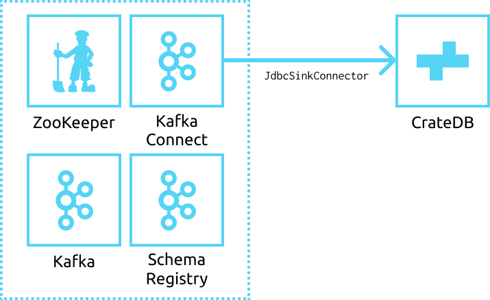

============================================
Data Ingestion using Kafka and Kafka Connect
============================================

This integration document details how to create an ingestion
pipeline from a `Kafka`_ source to a CrateDB sink, using the `Kafka Connect
JDBC connector`_.

Abstract
========

Kafka is a popular stream processing software used for building scalable
data processing pipelines and applications. There are many use cases where a
user might want the data from a Kafka topic (or several topics) ingested into a
CrateDB cluster for further enrichment, analysis or visualization. This can be
done using the supplementary component `Kafka Connect`_, which provides a set
of connectors that can stream data to and from Kafka.

Using the `Kafka Connect JDBC connector`_ with the PostgreSQL driver allows
you to designate CrateDB as a sink target, with the following example connector
definition:

.. code-block:: json

   {
     "name": "cratedb-connector",
     "config": {
       "connector.class": "io.confluent.connect.jdbc.JdbcSinkConnector",
       "topics": "metrics",
       "connection.url": "jdbc:postgresql://localhost:5432/doc?user=crate",
       "tasks.max": 1,
       "insert.mode": "insert",
       "table.name.format": "metrics",
     }
   }

This results in the following architecture:

.. _figure_1:

Implementation
==============

Setup
-----

To illustrate how this architecture can be used, we will create a scenario
where we have machine sensor data from a series of weather stations being
ingested into a Kafka topic. This data could be used in a reactive sense: for
example, a micro-controller could consume from this topic to turn on air
conditioning if the temperature were to rise above a certain threshold. But
besides this use of the data, we want to ingest them into CrateDB. This allows
us to do long-term data analytics to predict weather trends. Each payload from
each sensor looks like this:

.. code-block:: json

        {
          "id": "sensor-1",
          "timestamp": 1588240576,
          "payload": {
            "temperature": 43.2,
            "humidity": 12.2,
            "pressure": 1013.3,
            "luminosity": 3003.4,
          }
        }

The fields in the payload are:

- ``id`` - The identification string of the individual sensor.
- ``temperature`` - The temperature the sensor records, in Celsius.
- ``humidity`` - The humidity the sensor records, from 0% to 100%.
- ``pressure`` - The barometric pressure the sensor records, in millibar.
- ``luminosity`` - The ambient luminosity the sensor records, in lux.
- ``timestamp`` - The timestamp of when this payload was recorded.

Prerequisites
-------------

In order to deploy this architecture, there are several prerequisites:

- A running and accessible Kafka stack, including Kafka, ZooKeeper, Schema
  Registry and Kafka Connect. This example implementation will use the
  `Confluent Platform`_ to start and interact with the components, but there are
  many different avenues and libraries available.
- A CrateDB Cluster, running on at least version 4.2.0.
- A way of producing Kafka messages using an Avro schema. This implementation
  will use Python 3 with the ``confluent-kafka`` and ``avro-python3`` libraries.

Kafka Producer
--------------

First, start the Kafka stack. With the `Confluent Platform`_, starting a local
development stack can be done via:

.. code-block:: console

   $ confluent local start

   Starting zookeeper
   zookeeper is [UP]
   Starting kafka
   kafka is [UP]
   Starting schema-registry
   schema-registry is [UP]
   Starting connect
   connect is [UP]

Next, you should define the `Avro schema`_ that your producers, in this case
weather sensors, will produce. Given the structure described in the setup
section, the Avro schema will be:

.. code-block:: json

   {
     "namespace": "cratedb.metrics",
     "name": "value",
     "type": "record",
     "fields": [
       {"name": "id", "type": "string"},
       {"name": "timestamp", "type": "float"},
       {"name": "payload", "type": {
           "type": "record",
           "name": "payload",
           "fields": [
             {"name": "temperature", "type": "float"},
             {"name": "humidity", "type": "float"},
             {"name": "pressure", "type": "float"},
             {"name": "luminosity", "type": "float"}
           ]
         }
       }
     ]
   }

For the purposes of this example, this Python script will simulate the creation
of random sensor data and push it into the ``metrics`` topic:

.. code-block:: python

   from confluent_kafka import avro
   from confluent_kafka.avro import AvroProducer
   import time
   import random

   # Define the Avro schema we want our produced records to conform to.
   value_schema_str = """
   {
     "namespace": "cratedb.metrics",
     "name": "value",
     "type": "record",
     "fields": [
       {"name": "id", "type": "string"},
       {"name": "timestamp", "type": "float"},
       {"name": "payload", "type": {
           "type": "record",
           "name": "payload",
           "fields": [
             {"name": "temperature", "type": "float"},
             {"name": "humidity", "type": "float"},
             {"name": "pressure", "type": "float"},
             {"name": "luminosity", "type": "float"}
           ]
         }
       }
     ]
   }
   """

   # Load the Avro schema.
   value_schema = avro.loads(value_schema_str)

   # Create an Avro producer using the defined schema, assuming that our
   # Kafka servers are running at localhost:9092 and the Schema Registry
   # server is running at localhost:8081.
   avroProducer = AvroProducer(
       {
           "bootstrap.servers": "localhost:9092",
           "schema.registry.url": "http://localhost:8081",
       },
       default_value_schema=value_schema,
   )

   # Create a metric payload from a simulated sensor device.
   def create_metric():
       sensor_id = "sensor-" + str(random.choice(list(range(1, 21))))
       temperature = random.uniform(-5, 35)
       humidity = random.uniform(0, 100)
       pressure = random.uniform(1000, 1030)
       luminosity = random.uniform(0, 65000)
       timestamp = int(time.time())
       return {
           "id": sensor_id,
           "timestamp": timestamp,
           "payload": {
               "temperature": temperature,
               "humidity": humidity,
               "pressure": pressure,
               "luminosity": luminosity,
               "timestamp": timestamp,
           },
       }

   # Create a new metric every 0.25 seconds and push it to the metrics topic.
   while True:
       value = create_metric()
       avroProducer.produce(topic="metrics", value=value)
       avroProducer.flush()
       time.sleep(0.25)

This script can be run by installing the following dependencies and running it:

.. code-block:: console

   $ pip install "confluent-kafka[avro]" "requests" "avro-python3"
   $ python simulator.py

You can verify that the simulator is working by consuming from the Kafka topic:

.. code-block:: console

   $ confluent local consume metrics -- --from-beginning --value-format avro

   {"id":"sensor-13","timestamp":1.59180096E9,"payload":{"temperature":-1.8094289,"humidity":0.06487691,"pressure":1019.0834,"luminosity":41412.7}}
   {"id":"sensor-5","timestamp":1.59180096E9,"payload":{"temperature":15.625463,"humidity":39.6379,"pressure":1009.4658,"luminosity":58013.066}}
   {"id":"sensor-20","timestamp":1.59180096E9,"payload":{"temperature":5.555978,"humidity":34.635147,"pressure":1028.5662,"luminosity":16234.626}}
   {"id":"sensor-7","timestamp":1.59180096E9,"payload":{"temperature":12.604255,"humidity":70.70301,"pressure":1009.50116,"luminosity":37786.098}}

CrateDB
-------

The `PostgreSQL Kafka Connect JDBC driver`_ does not support nested structures
such as our payload object. The nested record will have to be flattened to
be ingested. You can do this using ``_`` as a delimiter, so that the
``payload.temperature`` field will be ingested into the ``payload_temperature``
column. Your CrateDB table's structure will, therefore, look like this:

.. code-block:: sql

  CREATE TABLE IF NOT EXISTS "doc"."metrics" (
    "timestamp" TIMESTAMP WITH TIME ZONE,
    "payload_temperature" REAL,
    "payload_humidity" REAL,
    "payload_pressure" REAL,
    "payload_luminosity" REAL,
    "id" TEXT
   );

Kafka Connect
-------------

Before you initialise the JDBC connector to ingest data into CrateDB, you should
first verify that the JDBC connector plugin is available on your Kafka Connect
instance.

You can do this by using the confluent command line tool, to list all available
Connect plugins:

.. code-block:: console

   $ confluent local list plugins
   HTTP/1.1 200 OK

    [
       ...
       {
           "class": "io.confluent.connect.jdbc.JdbcSinkConnector",
           "type": "sink",
           "version": "5.5.0"
       },
       {
           "class": "io.confluent.connect.jdbc.JdbcSourceConnector",
           "type": "source",
           "version": "5.5.0"
       },
       ...
   ]

Two of the connector plugins listed should be of the class
``io.confluent.connect.jdbc``, one of which is the `Sink Connector`_ and one of
which is the `Source Connector`_. You will be using the Sink Connector, as we
want CrateDB to act as a sink for Kafka records, rather than a source of Kafka
records.

Now, you can define the connector you want to initialize. The connector
definition for this use case would look like this, which you should save to a
file called ``cratedb_connector.json``:

.. code-block:: json

   {
     "name": "cratedb-connector",
     "config": {
       "connector.class": "io.confluent.connect.jdbc.JdbcSinkConnector",
       "topics": "metrics",
       "connection.url": "jdbc:postgresql://localhost:5432/doc?user=crate",
       "tasks.max": 3,
       "insert.mode": "insert",
       "table.name.format": "metrics",
       "transforms.flatten.type": "org.apache.kafka.connect.transforms.Flatten$Value",
       "transforms": "flatten",
       "transforms.flatten.delimiter": "_"
     }
   }

Here are the parameters in more detail:

+----------------------------------+--------------------------------------------------------------------------+
| Parameter                        | Description                                                              |
+==================================+==========================================================================+
| ``connector.class``              | The type of Connector plugin that you want to                            |
|                                  | initialize.                                                              |
+----------------------------------+--------------------------------------------------------------------------+
| ``connection.url``               | The URL to the CrateDB instance that you want                            |
|                                  | to act as the sink. This should be in the form                           |
|                                  | ``jdbc://postgresql://<CrateDB Host>:<PSQL Port>/<Schema>?user=<User>``. |
|                                  | In this implementation, the CrateDB is running                           |
|                                  | at ``localhost``, using the default PSQL port                            |
|                                  | of ``5432``, the schema ``doc`` and the default                          |
|                                  | CrateDB user ``crate``.                                                  |
+----------------------------------+--------------------------------------------------------------------------+
| ``topics``                       | The list of topics we want the connector to                              |
|                                  | consume from. In this implementation it is                               |
|                                  | only the ``metrics`` topic, but it could be                              |
|                                  | several.                                                                 |
+----------------------------------+--------------------------------------------------------------------------+
| ``tasks.max``                    | The max number of Connector tasks that should be                         |
|                                  | created to consume from this topic. Having a                             |
|                                  | number higher than 1 allows you to parallelize                           |
|                                  | consumption, to have higher throughput.                                  |
+----------------------------------+--------------------------------------------------------------------------+
| ``insert.mode``                  | How the data consumed from the topics should                             |
|                                  | be inserted into CrateDB. In this implementation                         |
|                                  | ``insert`` is chosen, as no primary key exists for                       |
|                                  | each record. If a primary key did exist, you could                       |
|                                  | use ``upsert`` to update records in the table if                         |
|                                  | they already exist for that primary key.                                 |
+----------------------------------+--------------------------------------------------------------------------+
| ``table.name.format``            | The table that the data should be used to ingest                         |
|                                  | the data. Although statically set here, you could                        |
|                                  | use the ``${topic}`` parameter to dynamically                            |
|                                  | insert into tables based on the topic name.                              |
+----------------------------------+--------------------------------------------------------------------------+
| ``transforms``                   | The `Kafka Connect Transformation`_ to use while                         |
|                                  | ingesting this data. In this case ``flatten``, since                     |
|                                  | the nested payload must be flattened so that the                         |
|                                  | PostgreSQL JDBC Connector can ingest it.                                 |
+----------------------------------+--------------------------------------------------------------------------+
| ``transforms.flatten.type``      | The type of `Flatten Transformation`_ to use.                            |
+----------------------------------+--------------------------------------------------------------------------+
| ``transforms.flatten.delimiter`` | Which delimiter to use to separate field names                           |
|                                  | when flattening nested structures.                                       |
+----------------------------------+--------------------------------------------------------------------------+

Many more `general Connector settings`_ as well as specific `JDBC Connector
settings`_ exist which can affect things like batch inserting, parallelization,
etc.

You can now create a connector instance using this configuration:

.. code-block:: console

   $ confluent local load cratedb-connector -- -d cratedb_connector.json

   {
     "name": "cratedb-connector",
     "config": {
       "connector.class": "io.confluent.connect.jdbc.JdbcSinkConnector",
       "topics": "metrics",
       "connection.url": "jdbc:postgresql://localhost:5432/doc?user=crate",
       "tasks.max": "1",
       "insert.mode": "insert",
       "table.name.format": "metrics",
       "transforms.flatten.type": "org.apache.kafka.connect.transforms.Flatten$Value",
       "transforms": "flatten",
       "transforms.flatten.delimiter": "_",
       "name": "cratedb-connector"
     },
     "tasks": [],
     "type": "sink"
   }

You can monitor the status of the newly created connector and verify that it
is running:

.. code-block:: console

   $ confluent local status cratedb-connector

   {
     "name": "cratedb-connector",
     "connector": {
       "state": "RUNNING",
       "worker_id": "127.0.0.1:8083"
     },
     "tasks": [
       {
         "id": 0,
         "state": "RUNNING",
         "worker_id": "127.0.0.1:8083"
       }
     ],
     "type": "sink"
   }

Finally, you can verify that data is flowing into the CrateDB table:

.. code-block:: console

   cr> SELECT count(*) FROM metrics;
   +----------+
   | count(*) |
   +----------+
   |     3410 |
   +----------+

   cr> SELECT * from metrics limit 5;
   +---------------+---------------------+------------------+------------------+--------------------+-----------+
   |     timestamp | payload_temperature | payload_humidity | payload_pressure | payload_luminosity | id        |
   +---------------+---------------------+------------------+------------------+--------------------+-----------+
   | 1591799971840 |          17.4522    |        33.82939  |       1012.5672  |          4301.833  | sensor-48 |
   | 1591799971840 |          -3.0050468 |        61.810287 |       1016.3813  |         60734.027  | sensor-23 |
   | 1591799971840 |           3.0375347 |        17.890663 |       1017.25525 |         10318.256  | sensor-26 |
   | 1591799971840 |          12.111576  |        70.71402  |       1003.64294 |          1785.4082 | sensor-2  |
   | 1591799971840 |          -0.5194106 |        17.87835  |       1022.2261  |         15849.575  | sensor-8  |
   +---------------+---------------------+------------------+------------------+--------------------+-----------+

.. _Kafka: https://www.confluent.io/what-is-apache-kafka/
.. _Kafka Connect JDBC connector: https://docs.confluent.io/current/connect/kafka-connect-jdbc/index.html
.. _Confluent Platform: https://docs.confluent.io/current/cli/index.html
.. _Avro schema: https://avro.apache.org/docs/current/spec.html
.. _PostgreSQL Kafka Connect JDBC driver: https://docs.confluent.io/current/connect/kafka-connect-jdbc/index.html#postgresql-database
.. _Sink Connector: https://docs.confluent.io/current/connect/kafka-connect-jdbc/sink-connector/index.html
.. _Source Connector: https://docs.confluent.io/current/connect/kafka-connect-jdbc/source-connector/index.html
.. _Kafka Connect Transformation: https://docs.confluent.io/current/connect/transforms/index.html
.. _Flatten Transformation: https://docs.confluent.io/current/connect/transforms/flatten.html#flatten
.. _general Connector settings: https://docs.confluent.io/2.0.0/connect/userguide.html#configuring-connectors
.. _JDBC Connector settings: https://docs.confluent.io/current/connect/kafka-connect-jdbc/sink-connector/sink_config_options.html
.. _Kafka Connect: https://docs.confluent.io/current/connect/index.html
