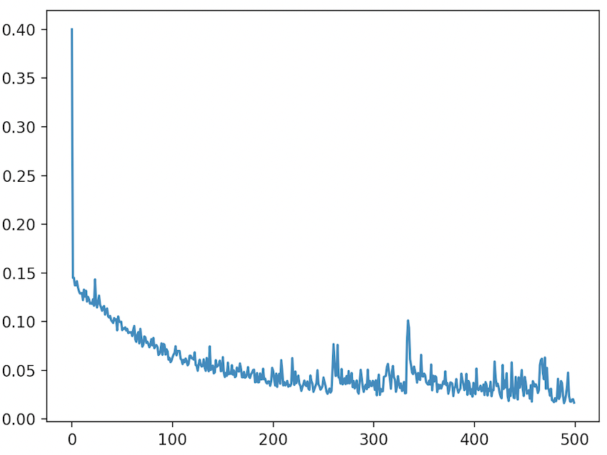

.. _cratedb-distributed-ml:

=====================================================
Distributed Deep-Learning with CrateDB and TensorFlow
=====================================================

Abstract
========

Using deep learning algorithms for Machine Learning use cases has become more 
and more common in the world of data science. A common library used for solving 
deep learning problems is `TensorFlow`_. It can be used to generate predictions 
based on various machine data features. 

CrateDB can easily be integrated into a Machine Learning application as a data 
source, as well as serving as a data store for the resulting predictions. The 
connection to CrateDB can be established using the `Psycopg2`_ and `Pandas`_ 
library. Preparing the data can be done with `Sklearn`_. This guide will 
demonstrate the process.

Implementation
==============

Set Up
------

For this distributed machine learning implementation, you will be using a
`Kaggle`_ data set called `pump_sensor_data`_.

The dataset contains data gathered from 52 sensors. These data rows come with 
a timestamp and a machine-status attached to them. There are three unique
states the machine can have:
- ``normal``
- ``broken``
- ``recovering``.

The data is stored in the CrateDB table ``ml.pump_sensors``.

Using this sensor data, you can predict whether the machine will fail within a 
specified time period in the future.

Using this data with TensorFlow, you will want to accomplish the following:

1. Retrieve data from CrateDB.
2. Show extracts of what the data looks like.
3. Prepare the data and build a machine learning model that will predict
   whether the machine will fail within a specified time window in the 
   future.
4. Save the previously built model on AWS S3.
5. Retrieve the model from AWS S3, predict sample data and insert the 
   results into the CrateDB table ``ml.pump_sensors_predictions``.

Prerequisites
-------------

- `A running CrateDB cluster`_
- `An AWS S3 storage bucket`_

To be able to use the *boto3* AWS client, you will need to provide credentials
to the client so you can connect to your AWS S3 Bucket. To not have these
credentials in the code, use an AWS config file at ``~/.aws/config`` so it
contains:

.. code-block:: python

    [default]
    aws_access_key_id=<key>
    aws_secret_access_key=<access_key>

- `Python`_
    - The `tensorflow`_ library
    - The `numpy`_ library
    - The `sklearn`_ library
    - The `pandas`_ library
    - The `psycopg2`_ library
    - The `boto3`_ library
    - The `joblib`_ library
    - The `matplotlib`_ library

The data from `pump_sensor_data`_ was cleaned before it was inserted into
CrateDB: in this case, renaming a column that was missing a name and filling in 
all the missing values with -1.

CrateDB
-------

In this first step, you need to make sure that you create the table that holds 
the pump sensor dataset as well as the table that will be storing the 
predictions:

.. code-block:: sql

    CREATE TABLE "ml"."pump_sensors"
    (
       "id" INTEGER,
       "timestamp" TEXT,
       "sensor_00" REAL,
       "sensor_01" REAL,
       "sensor_02" REAL,
       "sensor_03" REAL,
       "sensor_04" REAL,
       "sensor_05" REAL,
       "sensor_06" REAL,
       "sensor_07" REAL,
       "sensor_08" REAL,
       "sensor_09" REAL,
       "sensor_10" REAL,
       "sensor_11" REAL,
       "sensor_12" REAL,
       "sensor_13" REAL,
       "sensor_14" REAL,
       "sensor_15" REAL,
       "sensor_16" REAL,
       "sensor_17" REAL,
       "sensor_18" REAL,
       "sensor_19" REAL,
       "sensor_20" REAL,
       "sensor_21" REAL,
       "sensor_22" REAL,
       "sensor_23" REAL,
       "sensor_24" REAL,
       "sensor_25" REAL,
       "sensor_26" REAL,
       "sensor_27" REAL,
       "sensor_28" REAL,
       "sensor_29" REAL,
       "sensor_30" REAL,
       "sensor_31" REAL,
       "sensor_32" REAL,
       "sensor_33" REAL,
       "sensor_34" REAL,
       "sensor_35" REAL,
       "sensor_36" REAL,
       "sensor_37" REAL,
       "sensor_38" REAL,
       "sensor_39" REAL,
       "sensor_40" REAL,
       "sensor_41" REAL,
       "sensor_42" REAL,
       "sensor_43" REAL,
       "sensor_44" REAL,
       "sensor_45" REAL,
       "sensor_46" REAL,
       "sensor_47" REAL,
       "sensor_48" REAL,
       "sensor_49" REAL,
       "sensor_50" REAL,
       "sensor_51" REAL,
       "machine_status" TEXT
    );

    CREATE TABLE "ml"."pump_sensors_predictions"
    (
       "prediction" REAL,
       "ts" TIMESTAMP WITH TIME ZONE,
       "model_name" TEXT
    );

Once the tables have been created, you can import the data:

.. code-block:: sql

    COPY ml.pump_sensors FROM 'file:///path/to/sensor_new.csv'

To verify that the data has been successfully imported, you can query it:

.. code-block:: sql

    SELECT COUNT(*) from ml.pump_sensors
    +----------+
    | count(*) |
    +----------+
    | 220320   |
    +----------+
    SELECT OK, 1 row in set (0.024sec)

Training A Model
----------------

First, you can load the data into our Python context with ``Psycopg2`` and
``Pandas``:

.. code-block:: python

    import pandas.io.aql as sqlio
    from psycopg2 import connect

    # Connecting to CrateDB and retrieving the pump sensor data.
    with connect(conn_str) as conn:
        query = "SELECT * FROM ml.pump_sensors;"
        df = sqlio.read_sql_query(query, conn)

Once the data has been loaded into a dataframe, you can now start to prepare 
the data. This is so you can train a `Multilayer Perceptron`_ (MLP) to classify 
the machine status within a given time window.

You can make an assumption and combine the two labels ``RECOVERING`` and 
``BROKEN`` into a single label: ``BROKEN``. With this, you can say the machine 
is in either the state ``NORMAL`` or the state ``BROKEN``. Then you can 
binarize the labels so you can use them in the MLP. Additionally, you need to 
extract the sensor columns and split the data into train and test data frames, 
while normalizing their values between (0,1).

.. code-block:: python

    from sklearn.preprocessing import MinMaxScaler, label_binarize

    # Replacing the RECOVERING label with BROKEN so you only have two labels
    # and converting the string labels to numeric values (1 -> NORMAL, 0 -> BROKEN)
    df["machine_status"] = df["machine_status"].replace("RECOVERING", "BROKEN")
    df["machine_status"] = label_binarize(df["machine_status"], classes=["BROKEN", "NORMAL"])

    # Transform each feature of the data set in a range between 0 and 1
    min_max_scaler = MinMaxScaler(feature_range=(0, 1))

    # Defining the size of the train and test data: 70% will be used for training, 30% for testing
    test_split = 70
    df_size = len(df.index)
    split = int((df_size / 100) * test_split)

    # Create a new dataframe only containing the training data and the normalized training data columns
    df_train = df.iloc[0:split, :]
    train_data_cols = df_train.iloc[:, 2:54]
    norm_train_data_cols = min_max_scaler.fit_transform(train_data_cols)

    # Create a new dataframe only containing the test data and the normalized test data columns
    df_test = df.iloc[split:len(df.index), :]
    test_data_cols = df_test.iloc[:, 2:54]
    norm_test_data_cols = min_max_scaler.transform(test_data_cols)

The next step would be to define your time steps for the data. Let's take an 
input time of 60 minutes and try to predict whether the machine will fail in 
the next 12 hours. After defining these, you can create data pairs for training
the MLP model that fit into the time steps.

.. code-block:: python

    # Add this function over the main function.
    # with this function you check whether the time window contained the machine status BROKEN,
    # and if so, the whole time window will be considered to have the state BROKEN. If there
    # was no BROKEN state, label it NORMAL.
    def add_labels(start, stop, dataset):
        for step in range(start, stop):
            if dataset["machine_status"].iloc[step] == 0:
                return 0
        return 1

    timestep = 60
    output_timestep = 720

    # Now create training pairs. Each pair consists of the data of the specified
    # time window as well as the state of that time window. [(array([data]), 1), ...]
    # First, get the data of the given time window and flatten that data to a one
    # dimensional vector. Then save with the state that results from add_labels.
    train_pairs = []
    saved_step = 0
    for i in df_train.index:
        row = saved_step
        if row + timestep + output_timestep < len(df_train.index):
            data_window = norm_train_data_cols[row:row + timestep]
            data_vector = data_window.flatten()
            state = add_labels(row + timestep, row + timestep + output_timestep, df_train)
            train_pairs.append((data_vector, state))
            saved_step = row + timestep
        else:
            break

Now that you have created your training data pairs, you can start with 
splitting the pairs into two sets: x and y. Set x will be used to train the 
model and set y will be used to verify the model's accuracy.

.. code-block:: python

    import numpy as np

    # Length of the data vector
    input_len = train_pairs[0][0].shape[0]

    # Create the x and y train set in the correct size, where x will be used to train the model
    # and y for verifying the results
    x_train = np.zeros((len(train_pairs), input_len))
    y_train = np.zeros((len(train_pairs),))

    # Put the data vector from train_pairs in the x array and the state in the y array
    for index in range(0, len(train_pairs)):
        (x, y) = train_pairs[index]
        x_train[index, 0:input_len] = x
        y_train[index] = y

After creating your training data frames, you can now continue with creating 
the MLP model. For this example, use three layers, with the `ReLU`_ activation 
function for the first two layers. You can prevent the model degrading over 
successive epochs by stopping training, using the ``EarlyStopping`` callback.

.. code-block:: python

    import tensorflow as f
    import matplotlib.pyplot as plt
    from tensorflow.python.keras.callbacks import EarlyStopping
    from tensorflow.keras import layers

    # Create the Sequential object, which will function as a linear stack of the neural network
    # layers with exactly one input vector and one output.
    mlp_model = tf.keras.Sequential()

    # Adding the layers to the model, layers. 'Dense' means that it creates a fully connected
    # neural network layer.
    mlp_model.add(layers.Dense(200, activation="relu", input_shape=(input_len,)))
    mlp_model.add(layers.Dense(40, activation="relu"))
    mlp_model.add(layers.Dense(1))

    # Put together the the neural network and configure it with the
    # optimization algorithm, loss function and the metric which the
    # model uses to evaluate training and testing.
    mlp_model.compile(optimizer="adam",
                      loss=tf.keras.losses.MeanSquaredError(),
                      metrics=["accuracy"])

    # Set up the EarlyStopping: if the model gets worse 50 epochs in a row the
    # training will be stopped preemptively. Then you fit the data on our model,
    # meaning you train it with the given x_train and it can verify against y_train
    es = EarlyStopping(monitor="loss", mode="auto", verbose=1, patience=50)
    hist = mlp_model.fit(x_train, y_train, epochs=500, callbacks=[es])

    # Show a plot of the loss for each epoch
    plt.plot(hist.history["loss"])
    plt.show()

This figure shows us the loss of each epoch. In the first 200 epochs it is 
slowly going down, while starting to go up again at around the 250 epoch mark. 
The EarlyStopping, that should stop the training when degrading, does not stop
it here because it needs to degrade consistently over (in this case) 50 epochs 
to be stopped.

Now that you have your MLP model, you can start preparing the test data to 
verify the accuracy of the model.

.. code-block:: python

    # This works just like when you did the train_pairs before
    test_pairs = []
    test_saved_step = 0
    for i in df_test.index:
        row = test_saved_step
        if row + timestep + output_timestep < len(df_test.index):
            data_window = norm_test_data_cols[row:row + timestep]
            data_vector = data_window.flatten()
            state = add_labels(row + timestep, row + timestep + output_timestep, df_test)
            test_pairs.append((data_vector, state))
            test_saved_step = row + timestep
        else:
            break

    # This works just like when you did the x_train and y_train before
    x_test = np.zeros((len(test_pairs), input_len))
    y_test = np.zeros((len(test_pairs),))

    for index in range(0, len(test_pairs)):
        (x, y) = test_pairs[index]
        x_test[index, 0:input_len] = x
        y_test[index] = y

This data is prepared in the same way as the training data was prepared. It can now be used
with the model to generate predictions and to estimate the model's accuracy.

.. code-block:: python

    # Predict the x_test data with the model you created before. This works with
    # feed-forward passes in the neural network. Then the data is put into
    # a one dimensional vector form
    predictions = mlp_model.predict(x_test)
    predictions = predictions.flatten()

    # Evaluate the precision of the model by comparing the x and y data sets
    _, train_acc = mlp_model.evaluate(x_train, y_train, verbose=0)
    _, test_acc = mlp_model.evaluate(x_test, y_test, verbose=0)

    print("train_acc: ", train_acc)
    print("test_acc: ", test_acc)

    [1] train_acc: 0.9827990531921387
    [2] test_acc:  0.8741965293884277

The accuracy will vary slightly between the different executions. The training 
accuracy is nearly perfect, while the test accuracy is at 87%. These 
percentages apply when the training input is 60 minutes and the prediction 
output is for the next 720 minutes (12 hours). The results also vary depending 
on how many epochs one uses and the size of the timesteps.

Saving A Model To S3
--------------------

The next step is to save the model to a AWS S3 Bucket, so the model can be 
accessed from other applications. Since the data you want to predict will not 
be normalized like the model, you also need to save the ``MinMaxScaler`` you 
created previously alongside the TensorFlow model.

.. code-block:: python

    import os
    import boto3
    from joblib import dump

    bucket = "some-s3-bucket-name"

    # The .h5 extension is the common file extension for tensorflow models
    # Saving the model as a file
    model_name = "some-model-name" + ".h5"
    mlp_model.save(model_name)

    # The common file extension for joblib is .joblib
    # Save scaler as file
    scaler_name = "some-scaler-name" + ".joblib"
    dump(min_max_scaler, scaler_name)

    # Create the boto3 client to connect to the AWS S3 bucket, the credentials
    # will be read from the ~/.aws/config file and then the files will be
    # uploaded
    client = boto3.client("s3")
    client.upload_file(model_name, bucket, model_name)
    client.upload_file(scaler_name, bucket, scaler_name)

    # Remove the model / scaler files
    os.remove(model_name)
    os.remove(scaler_name)

The model and scaler will now be present in the S3 bucket, available for use from
other applications.

Predicting With Pre-Trained Model
---------------------------------

Now you can switch to another application. The following code should be put
into a different Python file than the above.

As the model is saved in an AWS S3 Bucket, you can load it from there and use 
it to predict pump sensor data without having to first train a model.

.. code-block:: python

    bucket = "some-s3-bucket-name"

    # These name should be the same as you used for saving the model, including the file extension
    model_name = "some-model-name"
    scaler_name = "some-scaler-name"

    # Create the boto3 client to connect to AWS S3 Bucket and download the files
    client = boto3.client("s3")
    client.download_file(bucket, model_name, model_name)
    client.download_file(bucket, scaler_name, scaler_name)

Now that the application has the trained models, you can load them and use them
to make predictions from new sets of sensor data.

.. code-block:: python

    import pandas.io.aql as sqlio
    import tensorflow as tf
    from joblib import load
    from psycopg2 import connect

    # Connecting to CrateDB and retrieving the pump sensor data.
    with connect(conn_str) as conn:
        query = "SELECT * FROM ml.pump_sensors;"
        df = sqlio.read_sql_query(query, conn)

    # Load the model and scaler from file
    model = tf.keras.models.load_model(model_name)
    scaler = load(scaler_name)

    # Retrieve the data cols from the whole data set as you only need those and then
    # normalize them with the scaler
    data_cols = df.iloc[:, 2:54]
    norm_data_cols = scaler.transform(data_cols)

    # Create the x_pred data set, containing the data of the specified time window as a vector
    x_pred = []
    pred_saved_step = 0
    for i in norm_data_cols.index:
        row = pred_saved_step
        if row + timestep < len(df_train.index):
            data_window = norm_data_cols[row:row + timestep]
            data_vector = data_window.flatten()
            x_pred.append(data_vector)
            pred_saved_step = row + timestep
        else:
            break

    # Predict the x_pred data set and make it into an array of one dimensional vectors
    predictions = model.predict(x_pred.reshape(1, -1))
    predictions.flatten()

    [1] [0.8614458441734314, 0.8530051112174988, 0.8502672910690308, 0.8750132918357849, 0.8636448979377747, ...]

Here you can see the first few predicted values. Everything ≥ 0.5 would mean 
that the machine is in a NORMAL state, while < 0.5 would mean it is BROKEN.

Saving The Predicted Values
---------------------------

As the final step, you can insert the predictions from the previous step into
our CrateDB instance.

.. code-block:: python

    import time

    query = "INSERT INTO ml.pump_sensors_predictions (prediction, ts, model_name) VALUES (%s, %s, %s);"

    with connect(conn_str) as conn:
        with conn.cursor() as cur:
            print("Inserting data...")
            for entry in predictions:
                cur.execute(query, (float(entry), time.time(), model_name))

With this, you have successfully used a deep learning algorithm, namely a 
multilayer perceptron. Using CrateDB to store raw data and model predictions, 
alongside using S3 for blob storage, you have created a distributed 
architecture where applications can use various pieces of this Machine Learning 
pipeline. The training and prediction stages are decoupled, and can be 
distributed across different machines, contexts, and scenarios.

.. _TensorFlow: https://www.tensorflow.org/
.. _Psycopg2: https://pypi.org/project/psycopg2/
.. _Pandas: https://pandas.pydata.org/
.. _Sklearn: https://scikit-learn.org/stable/
.. _Kaggle: https://www.kaggle.com/
.. _pump_sensor_data: https://www.kaggle.com/nphantawee/pump-sensor-data
.. _A running CrateDB cluster: https://crate.io/docs/crate/tutorials/en/latest/getting-started/index.html
.. _An AWS S3 storage bucket: https://aws.amazon.com/s3/
.. _Python: https://www.python.org/
.. _numpy: https://numpy.org/
.. _Multilayer Perceptron: https://en.wikipedia.org/wiki/Multilayer_perceptron
.. _ReLU: https://en.wikipedia.org/wiki/Rectifier_(neural_networks)
.. _boto3: https://boto3.amazonaws.com/v1/documentation/api/latest/index.html
.. _joblib: https://joblib.readthedocs.io/en/latest/index.html
.. _matplotlib: https://matplotlib.org/
