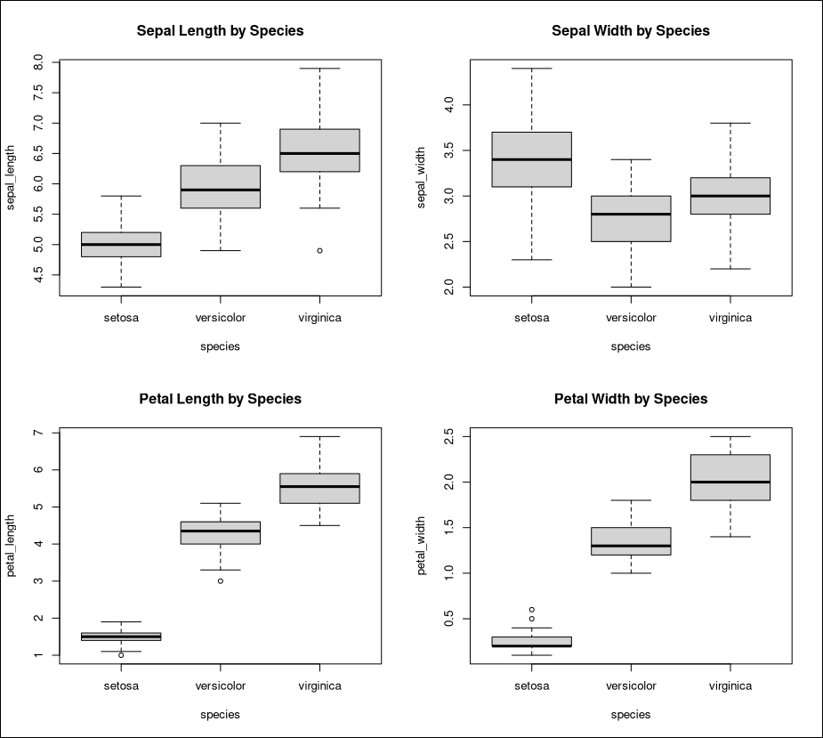

.. _cratedb-r:

==============
CrateDB with R
==============

This integration document details how to create a Machine Learning pipeline
using R and CrateDB.

Abstract
========

Statistical analysis and visualization on huge datasets is a common task many
data scientists face in their day-to-day life. One common tool for doing this
is `R`_ - a programming language and software environment geared towards
statistical computing. CrateDB can be paired with R to provide a source of
large, real-time machine-data for use in statistical analysis, visualization
and machine learning.

Similarly, CrateDB can also be used by R as a store of the results of these
statistical computations.

This can be accomplished with the `RPostgreSQL`_ library.

Implementation
==============

Set Up
------

For this implementation, we will be using the classic `iris classification
problem`_.

We have details about three species of iris: *iris setosa*, *iris
versicolor*, and *iris virginica*. These three species can be differentiated
by the width and length of their sepals and of their petals.

We have the details about these irises stored in a CrateDB table, ``doc.iris``.
We also have details about irises that we do not know the species of stored in
a CrateDB table, ``doc.unclassified_iris``.

Using R, we want to:

1. Retrieve data from a CrateDB instance.
2. Perform some data visualization so that we can see the differences between
   the three iris species.
3. Build a machine learning model from this data that will predict an iris
   species given the four features (sepal and petal width and length) we have
   measured.
4. Retrieve our unclassified iris data, enrich the data with a prediction from
   our model, and insert the result into our iris table.

Prerequisites
-------------

- `A running CrateDB cluster`_
- `R`_ (optionally with a third party tool like `RStudio`_)
    - The `RPostgreSQL`_ library
    - The `caret`_ library

To install these libraries within R or RStudio, we can run:

.. code-block:: r

    > install.packages("RPostgreSQL")
    > install.packages("caret")

CrateDB
-------

First, we need to create a table to hold our training data, as well as our
unclassified irises:

.. code-block:: sql

    CREATE TABLE iris
    (
        sepal_length DOUBLE,
        sepal_width  DOUBLE,
        petal_length DOUBLE,
        petal_width  DOUBLE,
        species      TEXT
    );

    CREATE TABLE unclassified_iris
    (
        sepal_length DOUBLE,
        sepal_width  DOUBLE,
        petal_length DOUBLE,
        petal_width  DOUBLE
    );

Once these tables have been created, we can import the iris data:

.. code-block:: sql

    COPY iris FROM 'file:///path/to/iris.csv';
    COPY unclassified_iris from 'file:///path/to/unclassified_iris.csv';

We can verify that the data has been successfully imported like so:

.. code-block:: sql

    SELECT COUNT(*) FROM iris;
    +----------+
    | count(*) |
    +----------+
    |      150 |
    +----------+
    SELECT 1 row in set (0.130 sec)

Examining The Data
------------------

With our data in CrateDB, we can now load it into R or RStudio. Within
R, we should first import our data. We do this by loading the ``RPostgreSQL``
library, connecting to a CrateDB database and loading the dataset:

.. code-block:: r

    # Loading the DBI library.
    > library(DBI)

    # Opening a connection, where dbname is the name of our schema, host is the address
    # of the CrateDB instance, port is the CrateDB Psql port, and user is the default
    # CrateDB user (in this case "crate").
    > con <- dbConnect(RPostgres::Postgres(),
                       dbname = "doc",
                       host = "localhost",
                       port = 5432,
                       user = "crate")

    # Loading the iris dataset from CrateDB
    > iris_dataset <- dbGetQuery(con, "SELECT * FROM doc.iris")

We can then validate that we have loaded the dataset correctly by looking at
the dimensions and the summary of the dataset:

.. code-block:: r

    # Getting the dimensions of the dataset.
    > dim(iris_dataset)
    [1] 150   5

    # This indicates it contains 150 instances across 5 attributes. We can check
    # the types of those attributes as well.
    > sapply(iris_dataset, class)
    sepal_length  sepal_width petal_length  petal_width      species
    "numeric"    "numeric"    "numeric"    "numeric"  "character"

    # Finally, we can look at the the statistical summary of our dataset.
    > summary(iris_dataset)
    sepal_length    sepal_width     petal_length    petal_width
    Min.   :4.300   Min.   :2.000   Min.   :1.000   Min.   :0.100
    1st Qu.:5.100   1st Qu.:2.800   1st Qu.:1.600   1st Qu.:0.300
    Median :5.800   Median :3.000   Median :4.350   Median :1.300
    Mean   :5.843   Mean   :3.054   Mean   :3.759   Mean   :1.199
    3rd Qu.:6.400   3rd Qu.:3.300   3rd Qu.:5.100   3rd Qu.:1.800
    Max.   :7.900   Max.   :4.400   Max.   :6.900   Max.   :2.500
    species
    Length:150
    Class :character
    Mode  :character

We can now visualize our data. For example, visualizing a boxplot of iris
properties by iris species might give us an insight about the distribution
of these properties across each species.

.. code-block:: r

    # Boxplot of iris features by each species
    > par(mfrow=c(2,2))
    > boxplot(sepal_length~species, data=iris_dataset, main="Sepal Length by Species")
    > boxplot(sepal_width~species, data=iris_dataset, main="Sepal Width by Species")
    > boxplot(petal_length~species, data=iris_dataset, main="Petal Length by Species")
    > boxplot(petal_width~species, data=iris_dataset, main="Petal Width by Species")

As we can see, the lengths and widths of sepals and petals are very good
indicators of iris species, with little overlap between them.

Training A Model
----------------

Now that we have loaded our data and can visualize it to get a better idea of
what it contains, we can create a machine learning model to predict a species
of iris given sepal length/width and petal length/width.

For this, we will use `Linear Discriminant Analysis`_ (LDA), a dimensionality
reduction technique often used in pattern classification, as is our goal here.

First, we will split our dataset into a set that contains 80% of the elements,
for training, and 20% of the elements, for use in validating our model:

.. code-block:: r

    # Creating a partition that contains 80% of the dataset
    validation_idx <- createDataPartition(iris_dataset$species, p=0.80, list=FALSE)

    # Creating a dataset that contains 20% of the initial dataset for validation
    > validation_dataset <- iris_dataset[-validation_idx,]

    # Using the remaining 80% of the dataset for training.
    training_dataset <- iris_dataset[validation_idx,]

    # We can examine the dimensions of our datasets to verify the results.
    > dim(training_dataset)
    [1] 120   5
    > dim(validation_dataset)
    [1] 30  5

We now have a dataset suitable for training and a dataset suitable for
validation. We can train an LDA model on this data, to predict the species
based on a flower's features.

.. code-block:: r

    # Importing the caret library
    > library(caret)

    # Training an LDA model, using the accuracy of the model to judge its effectiveness,
    # and controlling the training using a 15-fold cross-validation.
    > lda_model <- train(species~.,
                         data=training_dataset,
                         method="lda",
                         metric="Accuracy",
                         trControl=trainControl(method="cv", number=15))

Once this is trained, we can retrieve a summary of our model:

.. code-block:: r

    > print(lda_model)
    Linear Discriminant Analysis

    120 samples
    4 predictor
    3 classes: 'setosa', 'versicolor', 'virginica'

    No pre-processing
    Resampling: Cross-Validated (15 fold)
    Summary of sample sizes: 113, 111, 111, 112, 113, 114, ...
    Resampling results:

    Accuracy   Kappa
    0.9916667  0.9873016

Our final model has an accuracy of 99.1%, which is pretty good. We can test our
model on our verification dataset, and summarize the results in a confusion
matrix:

.. code-block:: r

    # Create some predictions from our validation dataset.
    > predictions <- predict(lda_model, validation_dataset)

    # Comparing our predictions against the actual dataset via a confusion matrix.
    > confusionMatrix(table(predictions, validation_dataset$species))
    Confusion Matrix and Statistics

    predictions  setosa versicolor virginica
    setosa         10          0         0
    versicolor      0          9         1
    virginica       0          1         9

    Overall Statistics

                   Accuracy : 0.9333
                     95% CI : (0.7793, 0.9918)
        No Information Rate : 0.3333
        P-Value [Acc > NIR] : 8.747e-12

Our basic model looks to have predicted the results of our validation dataset
with 93% accuracy - it has predicted all the setosa irises correctly, but
misclassified a *versicolor* as a *virginica* and vice versa. We could improve
this by trying out other models, by tweaking our model, or by training on a
larger dataset.

Enriching Data
..............

Now that we have a model we are happy with, we can use this model to enrich
unclassified iris flowers data.

Within CrateDB we have a table, ``doc.unclassified_iris``, that contains
irises without their classifications, which we can pull into R.

.. code-block:: r

    # Retrieving the dataset.
    unclassified_dataset <- dbGetQuery(con, "SELECT * FROM doc.unclassified_iris")
    > unclassified_dataset
    sepal_length sepal_width petal_length petal_width
    1           5.4         3.9          1.3         0.4
    2           4.9         2.4          3.3         1.0
    3           6.6         2.9          4.6         1.3
    4           6.5         3.0          5.5         1.8
    5           5.1         3.5          1.4         0.3
    6           7.7         3.8          6.7         2.2
    7           5.7         4.4          1.5         0.4
    8           5.2         2.7          3.9         1.4
    9           6.3         3.3          4.7         1.6
    10          7.7         2.6          6.9         2.3
    11          6.0         2.2          5.0         1.5

Using our LDA model, we can predict what species each of these are, and enrich
our unclassified dataset with the species predictions:

.. code-block:: r

    # Creating a copy of our unclassified set.
    > classified_dataset <- unclassified_dataset

    # Enriching the dataset with a species prediction.
    > classified_dataset$species <- predict(lda_model, unclassified_dataset)

    # Our resulting dataset.
    > classified_dataset
       sepal_length sepal_width petal_length petal_width    species
    1           5.4         3.9          1.3         0.4     setosa
    2           4.9         2.4          3.3         1.0 versicolor
    3           6.6         2.9          4.6         1.3 versicolor
    4           6.5         3.0          5.5         1.8  virginica
    5           5.1         3.5          1.4         0.3     setosa
    6           7.7         3.8          6.7         2.2  virginica
    7           5.7         4.4          1.5         0.4     setosa
    8           5.2         2.7          3.9         1.4 versicolor
    9           6.3         3.3          4.7         1.6 versicolor
    10          7.7         2.6          6.9         2.3  virginica
    11          6.0         2.2          5.0         1.5  virginica

And finally insert the newly classified iris flowers into our iris table:

.. code-block:: r

    > query <- "INSERT INTO iris (sepal_length, sepal_width, petal_length, petal_width, species) values ( %s, %s, %s, %s, '%s')"
    > for (i in 1:(dim(unclassified_dataset)[1]) ) {
    +     q <- sprintf(query,
    +                  unclassified_dataset[i,1],
    +                  unclassified_dataset[i,2],
    +                  unclassified_dataset[i,3],
    +                  unclassified_dataset[i,4],
    +                  unclassified_dataset[i,5])
    +     dbSendQuery(con, q)
    + }

With this, we have successfully built a machine learning model within R, enriched
data from CrateDB using this model, and written our enriched results back into
CrateDB.

.. _R: https://www.r-project.org/
.. _RPostgreSQL: https://cran.r-project.org/web/packages/RPostgreSQL/index.html
.. _iris classification problem: https://en.wikipedia.org/wiki/Iris_flower_data_set
.. _A running CrateDB cluster: https://crate.io/docs/crate/tutorials/en/latest/getting-started/index.html
.. _RStudio: https://rstudio.com/
.. _caret: https://cran.r-project.org/web/packages/caret/index.html
.. _Linear Discriminant Analysis: https://en.wikipedia.org/wiki/Linear_discriminant_analysis
