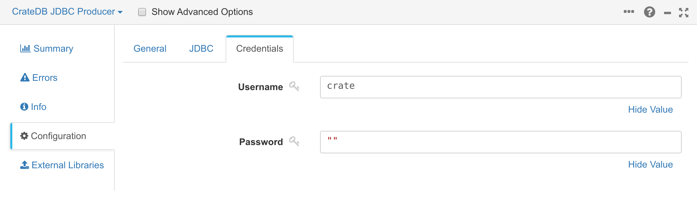

.. _cratedb-streamsets:

================================================================
Data Stream Pipelines with CrateDB and StreamSets Data Collector
================================================================

This integration document details how to create data streaming pipelines
using CrateDB and StreamSets Data Collector.

Abstract
========

The `StreamSets Data Collector`_ is a lightweight and powerful engine that
allows you to build streaming, batch and change-data-capture (CDC) pipelines
that can ingest and transform data from a variety of different sources.

The data collector can be paired with CrateDB either as an endpoint or as a
source for the pipelines you create, leveraging CrateDB's excellent warehousing
and query functionality.

This can be done using the `CrateDB JDBC driver`_ as an external library.

Implementation
==============

Set Up
------

For this implementation, you will ingest and transform the data from
StreamSet's `New York taxi dataset`_ into a CrateDB table, where it can
then be used in analytics/visualization queries.

Prerequisites
-------------

- `A running and accessable CrateDB cluster`_
- `A running and accessable StreamSets Data Collector`_
- StreamSet's `New York taxi dataset`_ downloaded to a location that can be
  accessed by the Data Collector.
- The `CrateDB JDBC driver`_ installed as an external library for the data
  collector.

To install the CrateDB JDBC driver, download the latest standalone version
from Crate.io's `Bintray Repository`_. Once downloaded, the JDBC driver can be
installed for StreamSets. We recommend following the StreamSet's tutorial on
installing `external libraries`_, but you can also include the CrateDB JDBC
driver JAR file in the StreamSet's classpath if you wish to provide it that
way.

CrateDB
-------

First, you need to create the table that will hold the New York taxi dataset:

.. code-block:: sql

    CREATE TABLE "doc"."taxi" (
        "hack_license" TEXT,
        "medallion" TEXT,
        "total_amount" FLOAT,
        "tip_amount" FLOAT
    );

With the CrateDB table created, you can now open StreamSets and begin building
the pipeline.

Using CrateDB as a Destination
------------------------------

Firstly, create a new Data Collector Pipeline:

You can then add an origin for the pipeline. In this case, you will be reading
from the .csv file you downloaded earlier. To do this, add a **Directory** origin
for the pipeline. You should then configure the directory origin so that it picks
up the New York taxi CSV file:

You can then also configure the data format of the file. The data format
should be **delimited**, with the format type being **Default CSV**. The CSV
file also includes a header line, so ensure the header line setting is **With
Header Line**:

Before you can ingest this data into CrateDB, you need to perform some lightweight
field type transformations on the data. This is because all source fields
are represented as strings in the CSV; but the ``total_amount`` and ``tip_amount``
columns in the CrateDB table are floats.

To do this, add a new **Field Type Converter** processor that connects to the
Directory origin you created in the previous step. Once created, add the
following field conversions to the field type converter's configuration:

Once configured, you can finally add CrateDB as a destination for the pipeline.
To do this, select a **JDBC Producer** destination that connects to the processor
you created in the previous step. You can then configure the JDBC producer to
connect to your CrateDB instance.

The JDBC settings should be as follows:

You can also look at the external libraries of the JDBC producer to ensure
the CrateDB JDBC driver is present:

Once created, your pipeline should look something like this:

You can now start the pipeline by clicking the **Start** button, and data will
flow from the CSV file, through the type transformer and into CrateDB:

You can verify that the data is now in CrateDB:

.. code-block:: sql

    cr> SELECT COUNT(*), AVG(total_amount), AVG(tip_amount) FROM doc.taxi;
    +----------+--------------------+--------------------+
    | count(*) |  avg(total_amount) |    avg(tip_amount) |
    +----------+--------------------+--------------------+
    |     5383 | 14.881101593837494 | 1.1379472384076705 |
    +----------+--------------------+--------------------+
    SELECT 1 row in set (0.050 sec)

.. _A running and accessable CrateDB cluster: https://crate.io/docs/crate/howtos/en/latest/deployment/index.html
.. _A running and accessable StreamSets Data Collector: https://streamsets.com/products/dataops-platform/data-collector/
.. _Bintray Repository: https://bintray.com/crate/crate/crate-jdbc/view/files/io/crate/crate-jdbc-standalone/
.. _CrateDB JDBC driver: https://crate.io/docs/jdbc/en/latest/
.. _external libraries: https://streamsets.com/documentation/datacollector/latest/help/datacollector/UserGuide/Configuration/ExternalLibs.html
.. _New York taxi dataset: https://streamsets.com/documentation/datacollector/latest/help/datacollector/UserGuide/Tutorial/BeforeYouBegin.html?hl=nyc_taxi_data/
.. _StreamSets Data Collector: https://streamsets.com/products/dataops-platform/data-collector/
