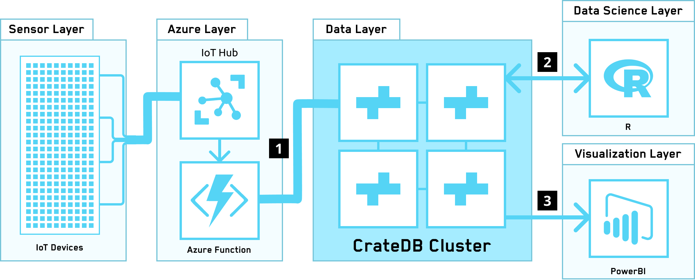

====================
CrateDB on Azure IoT
====================

Architecture
============

This reference architecture enables high throughput ingestion and enrichment
of raw sensor data from a fleet of sensors. Once ingested into CrateDB, this
data can be used to perform data science as well as to build real-time 
data-driven dashboards and reporting.

.. _figure_1:

Integrations
============

This architecture makes use of the following integrations with CrateDB:

1. :ref:`cratedb-azure-functions`
2. :ref:`cratedb-r`
3. :ref:`cratedb-powerbi-desktop` or :ref:`cratedb-powerbi-service`, depending
   on your requirements and use case.

