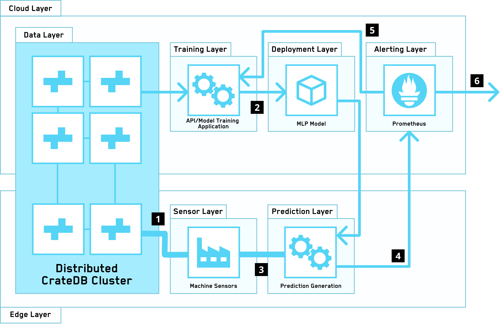

========================================
Distributed Machine Learning At The Edge
========================================

Architecture
============

This architecture enables an iterative machine learning
application that distributes its components across the cloud and the factory
edge. It does this by distributing a CrateDB cluster across these two layers.

In the cloud layer, an application reads sensor data from the CrateDB cluster
and trains a MLP model from the data, which it then publishes. It also runs
a `Prometheus`_ node that triggers a retraining of the model if the model's
predictive quality degrades, as well as alerting users based on the
predictions emanating from the prediction layer.

In the edge layer, an application uses the latest published MLP model and uses
it in conjunction with a stream of data from the factory sensors. It publishes
its predictions as well as model quality as a series of metrics to the
Prometheus node running in the cloud layer.

.. _figure_1:

Components
==========

This architecture makes use of the following components and CrateDB integrations:

1. Ingestion of data from machine sensors to the CrateDB nodes at the factory
   edge.
2. :ref:`cratedb-distributed-ml`
3. A stream of data from the factory sensors to the prediction layer application.
4. Model quality and prediction metrics being pushed to Prometheus.
5. Prometheus `Alertmanager`_ triggering a model rebuild if the model quality
   degrades.
6. Prometheus `Alertmanager`_ triggering an alert to users if the prediction
   layer's predictions fall within dangerous thresholds.

.. _Alertmanager: https://www.prometheus.io/docs/alerting/latest/alertmanager/
.. _Prometheus: https://prometheus.io/
