.. _cratedb-powerbi-service:

===========================================
Real Time Reports with CrateDB and Power BI
===========================================

Abstract
========

The `Power BI service`_ is a powerful online data analysis and visualization
tool. When paired with CrateDB, users can construct reports backed by large
datasets which can then be refreshed periodically from CrateDB, ensuring that
the reports and dashboards are up to date.

This can be done using the `On-Premises Data Gateway`_ to act as a bridge
between CrateDB and the Power BI service.

Implementation
==============

Set Up
------

This implementation will demonstrate real-time reports with CrateDB and Power
BI by visualizing the data from the `World Economic Outlook survey`_. 
Specifically, you will make a report using population figures from the survey 
across different regions. You will also want to publish this report, so your 
colleagues can view it, as well as to enable data refreshing so that your 
report uses the latest data.

Prerequisites
-------------

- `A running and accessable CrateDB cluster`_
- `Power BI Desktop`_
- `Microsoft Work/School account`_ or a `Power BI Pro/Trial account`_
- The `On-Premises Data Gateway`_ installed on a Windows machine that can access
  the CrateDB cluster. For the sake of simplicity, this implementation
  installs the gateway on the same machine that wrote the report for Power BI
  Desktop.

Follow Microsoft's documentation on how to `install`_ and `configure`_ the
on-premises gateway. When it is finished installing and configuring, you
should see something like the following status:

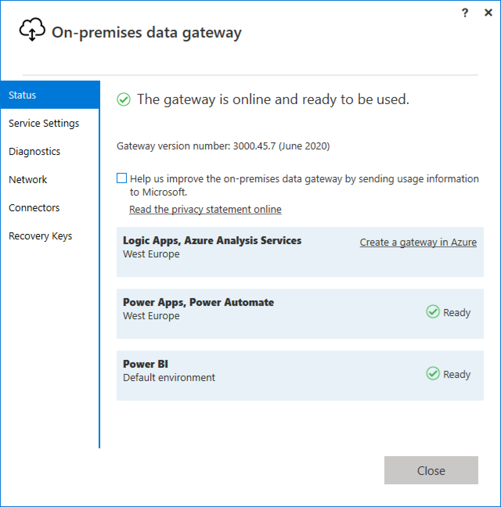

Ensure that the **Power BI** status for the gateway is **Ready**.

Creating a Report With CrateDB and Power BI Desktop
---------------------------------------------------

Before you can publish your report, you need to have created it first.
You can do this using the data from CrateDB. Please follow the 
:ref:`CrateDB and PowerBI Desktop<cratedb-powerbi-desktop>`
reference architecture guide to do this.

After running through that guide, we should have the following report:

.. figure:: powerbi-pie-chart.png
   :align: center

Publishing the Report
---------------------

With your report created on Power BI desktop, you can now publish it to the
online Power BI service. First, click the *Publish* button in the ribbon. Next,
choose a destination to publish to:

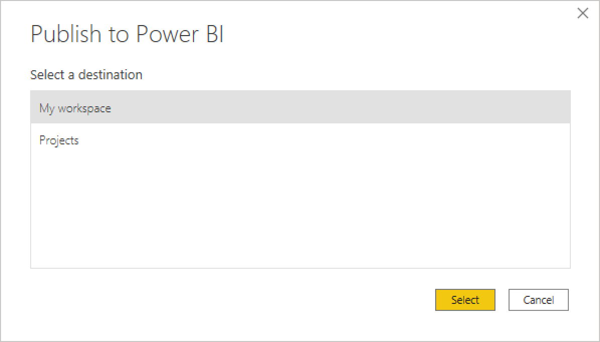

When your publishing is successful, you can then open the report in the
Power BI service:

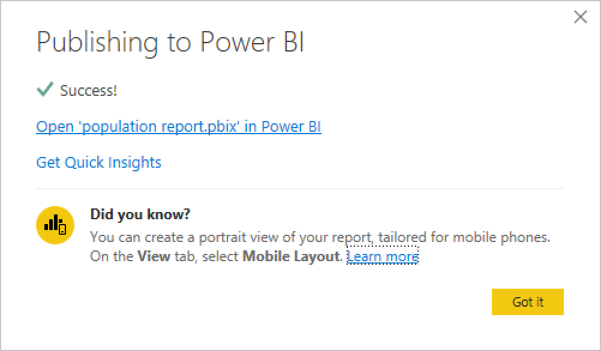

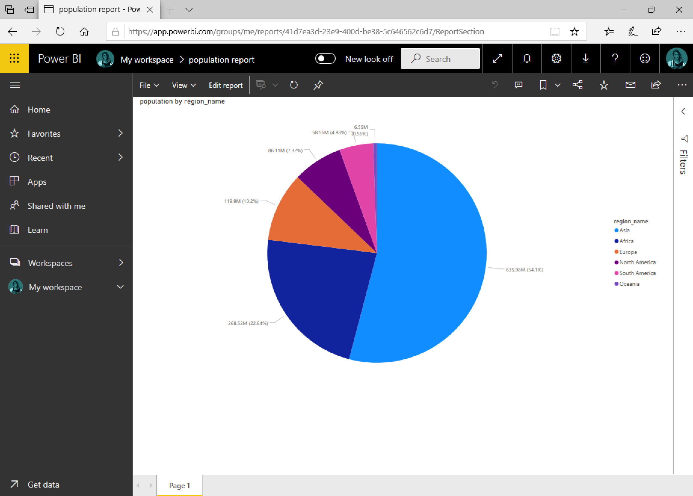

The report can now be shared via its URL. However, this is just a static
snapshot of the data. Data may change over time as it is grows, is enriched
or gets discarded, and your reports should reflect this changing data.

Power BI allows you to `refresh the datasets`_ your reports use. This
refreshing can be triggered manually or on a set schedule. It
does this by using the `On-Premises Data Gateway`_. The Gateway acts as a
bridge between the online report and your CrateDB data source, allowing the
Power BI service to retrieve up to date datasets from CrateDB.

Configuring The Gateway
-----------------------

Within the Power BI service's settings, select *Manage Gateways*:

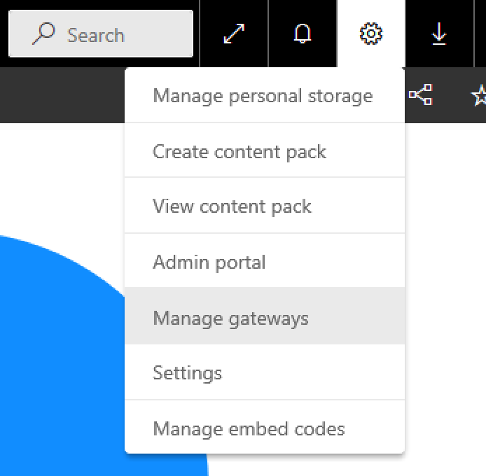

You should see the gateway cluster you set up. When you click *Test all
connections*, you should see your cluster has the 'Online' status:

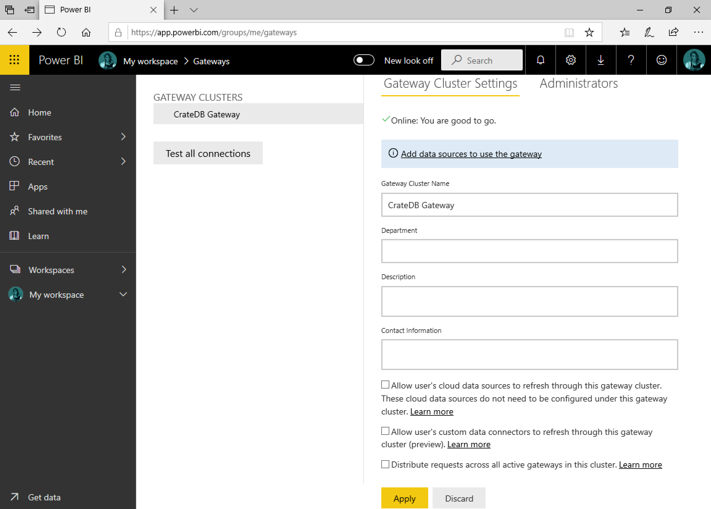

Click *Add data sources to use the gateway*. In the data source settings,
name your datasource, select the **ODBC** type, and enter the connection
ODBC connection string. The connection string will be whatever you named
the DSN when connecting Power BI Desktop to CrateDB. In this case, it was
``CrateDB``, so the ODBC connection string will be ``dsn=CrateDB``.

.. note::
   For this to work, the DSN should have been created as a **system DSN**, not
   a **user DSN**. If the connection test fails, verify that you have a
   system DSN on the machine that hosts the gateway for the CrateDB connection.

Hit apply, and if the settings are correct it will display that the connection
was successful:

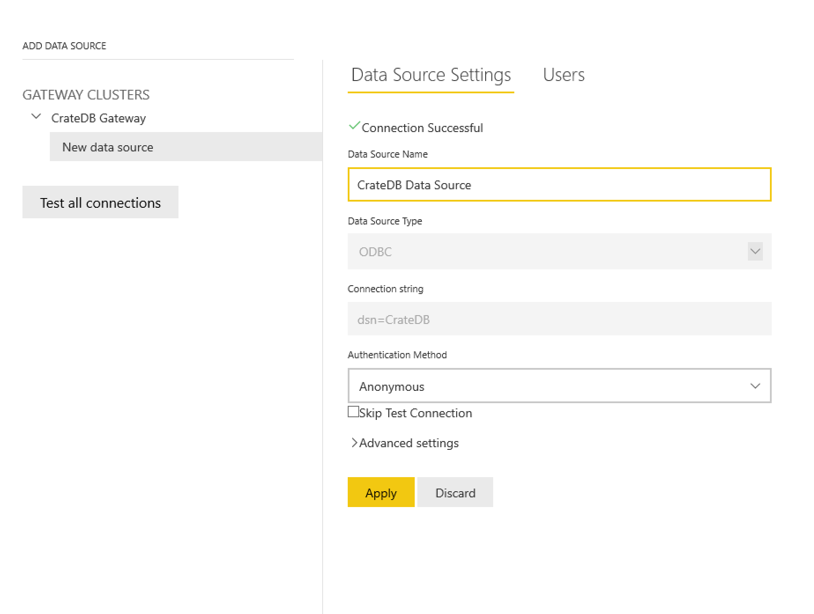

Once successful, go to the *Users* tab and select the users you would like to
be able to access this data source to publish reports.

Now, navigate back to the Power BI Service and click on the extra options
for your ``population report`` data set, and click *Schedule refresh*.

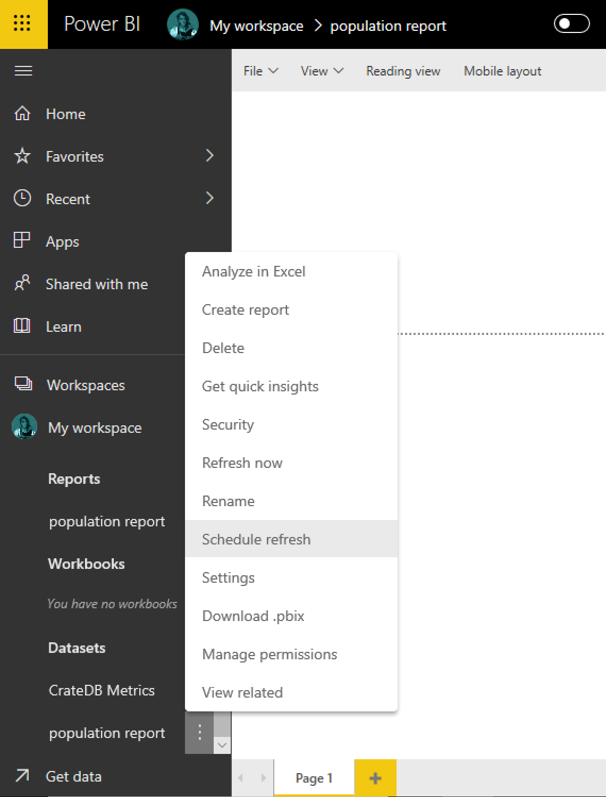

In the *Gateway connection* section of the dataset's settings, configure
the dataset to use the data gateway you set up previously and click apply:

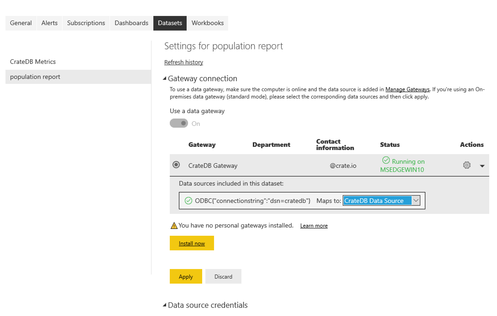

The report is now configured to use the gateway.

Modifying the Data
------------------

To demonstrate this refresh capability, you can modify the data in our CrateDB
source. For example, your business could no longer be interested in data
about Europe. You can delete this from your table via:

.. code-block:: sql

    cr> DELETE FROM population_data WHERE region_name = 'Europe';

    DELETE OK, 270990 rows affected  (2.125 sec)

Refreshing the Report
---------------------

Now that the dataset powering our report has changed, you can refresh it. As
before, click on the extra settings for the ``population report`` dataset, and
click *Refresh now*.

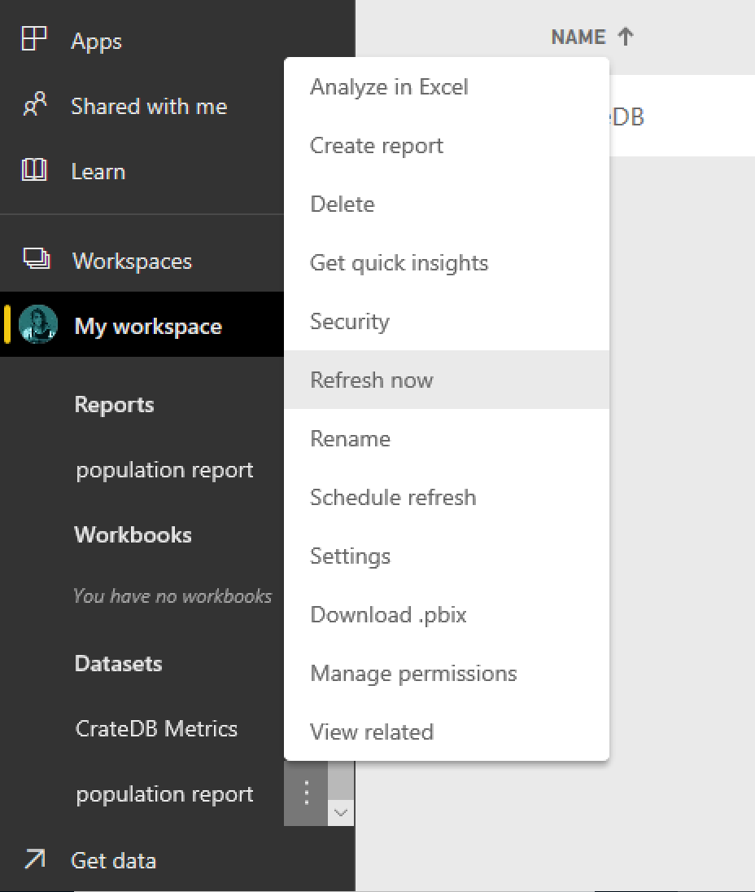

If you navigate to the dataset settings, you should see that a refresh is in
progress:

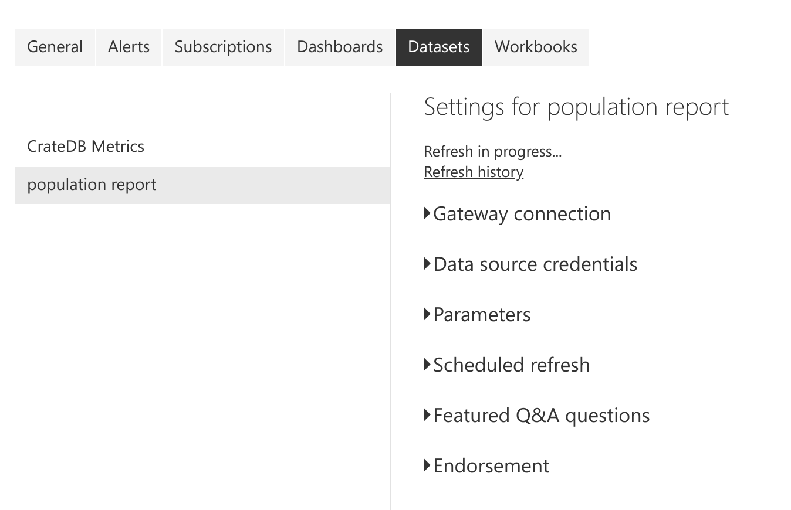

Once it succeeds, you should see a message in its place about when the
successful refresh occurred. Once done, you can navigate back to your report
and refresh it to see the new dataset underlying the pie chart:

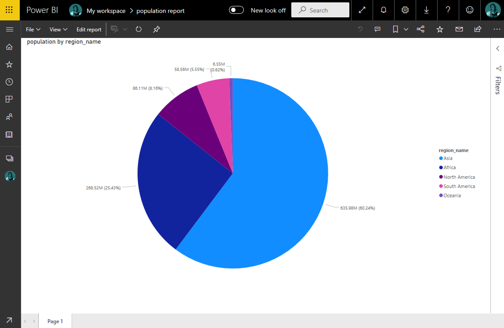

As you can see, the report no longer contains 'Europe' as one of the regions.

Now that you have successfully refreshed the dataset, you can set up a
scheduled refresh in the dataset's settings, so that your reports can be
updated periodically.

.. _Power BI service: https://powerbi.microsoft.com/en-us/
.. _World Economic Outlook survey: https://www.imf.org/en/Publications/WEO
.. _A running and accessable CrateDB cluster: https://crate.io/docs/crate/tutorials/en/latest/getting-started/index.html
.. _Power BI Desktop: https://powerbi.microsoft.com/en-us/desktop/
.. _Microsoft Work/School account: https://support.microsoft.com/en-ca/help/4013943/sign-in-using-work-or-school-account
.. _Power BI Pro/Trial account: https://app.powerbi.com/signupredirect?pbi_source=web
.. _On-Premises Data Gateway: https://docs.microsoft.com/en-us/power-bi/connect-data/service-gateway-onprem
.. _install: https://docs.microsoft.com/en-us/data-integration/gateway/service-gateway-install
.. _configure: https://docs.microsoft.com/en-us/data-integration/gateway/service-gateway-app
.. _refresh the datasets: https://docs.microsoft.com/en-us/power-bi/refresh-data
