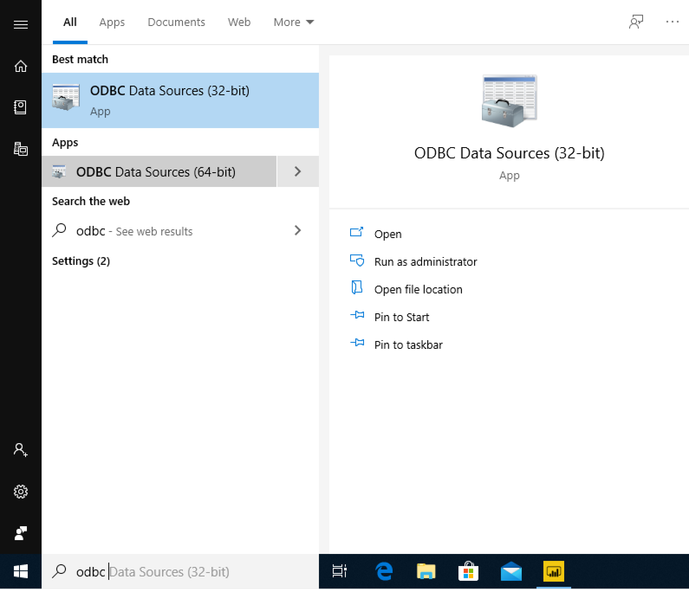
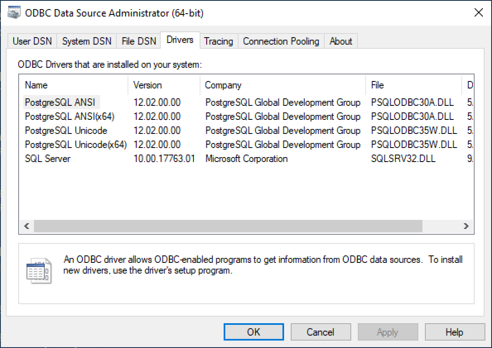
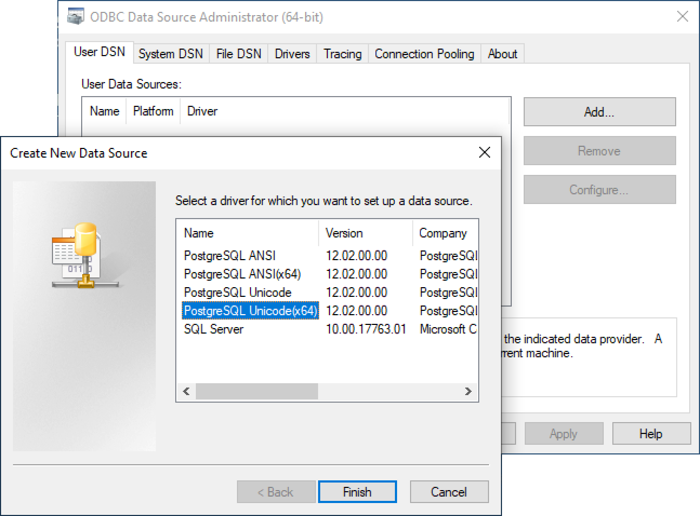
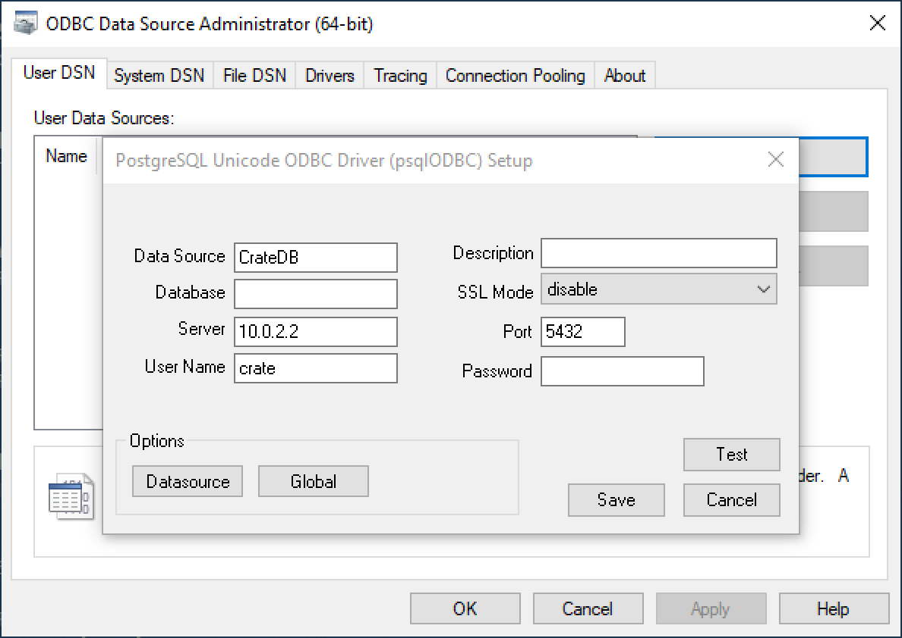
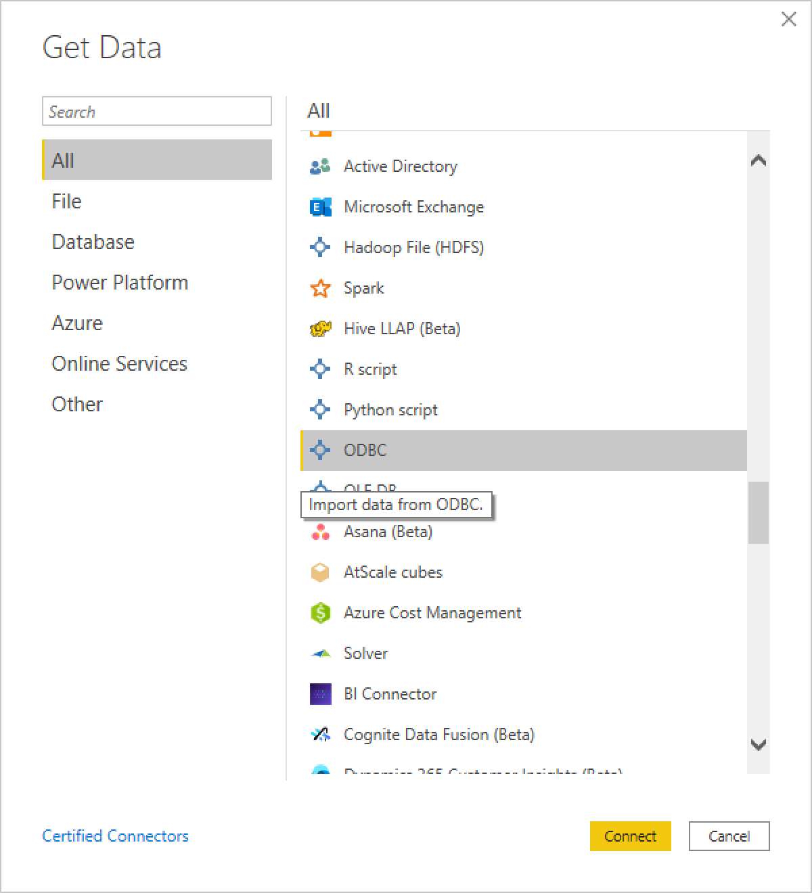
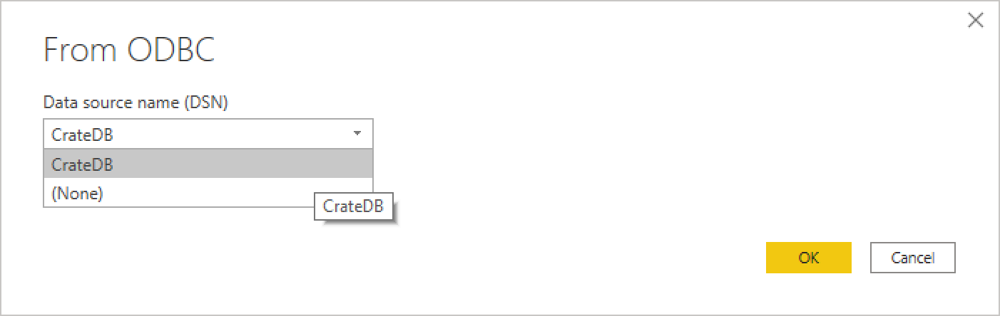
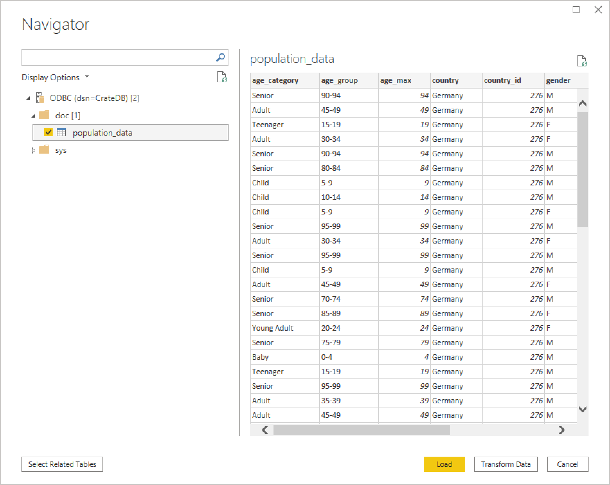
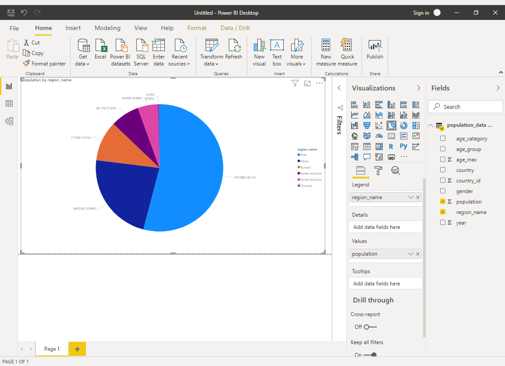

=============================
CrateDB with Power BI Desktop
=============================

Abstract
========

`Power BI Desktop`_ is a powerful `business intelligence`_ tool that provides
a set of data analytics and visualizations. Using Power BI Desktop, users can
create reports and dashboards from large datasets.

By using CrateDB as a data source from which Power BI Desktop can draw data,
users can set up powerful data warehousing and business intelligence
reports.

Implementation
==============

Set Up
------

For this implementation, we will be visualizing the data from the `World
Economic Outlook survey`_. In particular, we will use population figures,
gender breakdowns, and age groups across different countries.

Prerequisites
-------------

- `A running and accessable CrateDB cluster`_
- `Power BI Desktop`_
- The `PostgreSQL ODBC driver`_

To install the PostgreSQL ODBC driver on Windows, head to the `downloads
section`_ for MSI installers and download the latest version corresponding to
your architecture. For example, if you are using 64-bit Windows, at the time
of writing the correct installer would be ``psqlodbc_12_02_0000-x64.zip``.

Within the zip archive is an MSI installer. Execute it and follow the
instructions.

CrateDB
-------

First, you need to create a table to hold the World Economic Outlook survey
data:

.. code-block:: sql

    CREATE TABLE IF NOT EXISTS "doc"."population_data" (
        "age_category" TEXT,
        "age_group" TEXT,
        "age_max" DOUBLE PRECISION,
        "country" TEXT,
        "country_id" INTEGER,
        "gender" TEXT,
        "population" DOUBLE PRECISION,
        "region_name" TEXT,
        "year" INTEGER
    );

Once this table has been created, you can import the data. You can download
the `raw data`_ and process it however you like. However, a `preprocessed
archive`_ is also available that makes it easier to insert.

To insert the data into CrateDB::

    COPY population_data
    FROM 'file:///path/to/population_data_*.json.gz
    WITH (compression='gzip')
    RETURN SUMMARY;

    +----------------------------------------+-------------------------------------------+---------------+-------------+--------+
    | node                                   | uri                                       | success_count | error_count | errors |
    +----------------------------------------+-------------------------------------------+---------------+-------------+--------+
    | {"id": "...", "name": "Hoher Riffler"} | file:///path/to/population_data0_.json.gz |        310991 |           0 | {}     |
    | {"id": "...", "name": "Hoher Riffler"} | file:///path/to/population_data1_.json.gz |        309975 |           0 | {}     |
    | {"id": "...", "name": "Hoher Riffler"} | file:///path/to/population_data2_.json.gz |        309586 |           0 | {}     |
    | {"id": "...", "name": "Hoher Riffler"} | file:///path/to/population_data3_.json.gz |        309980 |           0 | {}     |
    +----------------------------------------+-------------------------------------------+---------------+-------------+--------+

Creating a DSN for CrateDB
--------------------------

First, verify that you have installed the PostgreSQL ODBC driver by searching
for and opening the ODBC Data Sources application for your architecture:

Navigate to the drivers tab, where you should see the PostgreSQL ODBC drivers
you have installed:

If this is correct, you can add a User DSN by navigating to the User DSN tab
and hitting *Add*. From the drivers, select *PostgreSQL Unicode(x64)* if you
are using a 64-bit Windows. Otherwise, select *PostgreSQL Unicode(x32)*.

Set up the data source with the following parameters:

+---------------+--------------------------------------------+
| **Parameter** | **Value**                                  |
+===============+============================================+
| Data Source   | ``CrateDB``                                |
+---------------+--------------------------------------------+
| Server        | The URL or IP of your CrateDB server.      |
+---------------+--------------------------------------------+
| User Name     | The CrateDB user you wish to connect with. |
+---------------+--------------------------------------------+
| Port          | ``5432``                                   |
+---------------+--------------------------------------------+

If your CrateDB instance uses SSL, enable the SSL mode. If the CrateDB user
you're connecting with is password protected, add its password to the Password
field.

You can click *Test* to verify that the DSN is configured correctly. Once this
is done, click *Save* to save the DSN.

Connecting Power BI to CrateDB
------------------------------

Once you have created the DSN, open up Power BI and click *Get Data* from the
menu ribbon. Select *ODBC* from the list of available data sources:

Select CrateDB from the DSN list and click *OK*:

Within the ``doc`` schema, you should see and be able to add the
``population_data`` table:

From here you can transform the data as you wish, or click *Load* to load
the dataset.

Data Visualization
------------------

Once the dataset has been added, you can visualize some of it. For example,
you can visualize the distribution of population by region.

First, select the *Pie Chart* from the visualizations tab. Then, drag the
``population`` field from the fields panel into the *Values* section in the
visualizations tab. Finally, drag the ``region_name`` field from the fields
panel into the *Legend* section of the visualizations tab.

The pie chart will be updated automatically, and will produce the following:

.. _business intelligence: https://en.wikipedia.org/wiki/Business_intelligence
.. _World Economic Outlook survey: https://www.imf.org/en/Publications/WEO
.. _A running and accessable CrateDB cluster: https://crate.io/docs/crate/tutorials/en/latest/getting-started/index.html
.. _Power BI Desktop: https://powerbi.microsoft.com/en-us/desktop/
.. _PostgreSQL ODBC driver: https://odbc.postgresql.org/
.. _downloads section: https://www.postgresql.org/ftp/odbc/versions/msi/
.. _raw data: https://www.imf.org/external/pubs/ft/weo/2017/01/weodata/index.aspx
.. _preprocessed archive: https://crate.io/wp-content/uploads/2018/11/copy_from_population_data.zip

