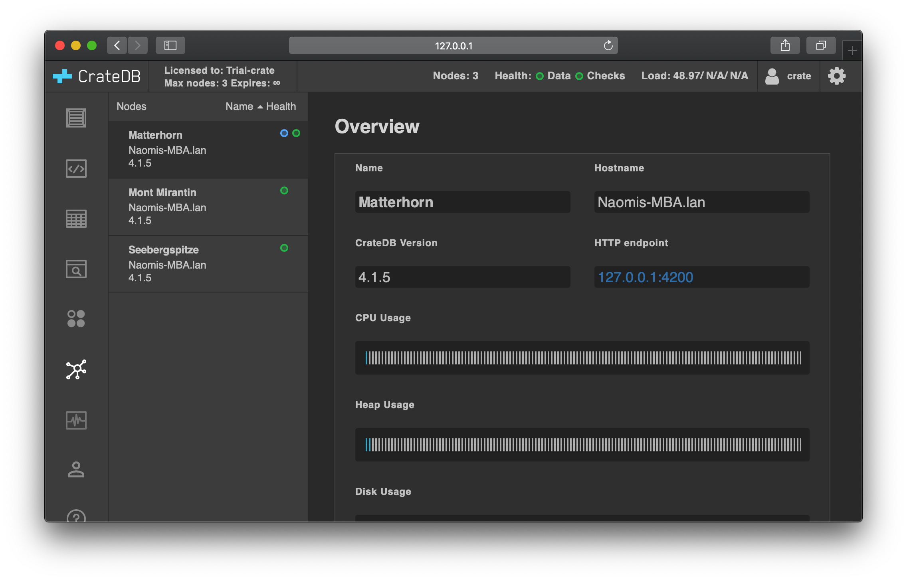

.. _multi_node_setup:

========================
CrateDB multi-node setup
========================

CrateDB can run on a single node. However, in most environments, CrateDB is run
as a cluster of three or more nodes.

For development purposes, CrateDB can :ref:`auto-bootstrap
<auto-bootstrapping>` a cluster when you run all nodes on the same host.
Auto-bootstrapping requires zero configuration. However, in production
environments, you must configure the bootstrapping process :ref:`manually
<manual-bootstrapping>`.

This guide shows you how to bootstrap a multi-node CrateDB cluster using the
method of your choice.

.. rubric:: Table of contents

.. contents::
   :local:

.. _cluster-bootstrapping:

Cluster bootstrapping
=====================

.. _auto-bootstrapping:

Single host auto-bootstrapping
------------------------------

If you start up several nodes (with default configuration) on a single host,
they will automatically discover one another and form a cluster.

If you want to run CrateDB on your local machine for development or
experimentation purposes, this is probably your best bootstrapping option.

.. CAUTION::

    Single host auto-bootstrapping is useful for development environments.
    However, for improved performance and resiliency, :ref:`production
    <going-into-production>` CrateDB clusters should be run with :ref:`one node
    per host machine <manual-bootstrapping>`. If you use multiple hosts, you
    must configure your cluster with :ref:`manual bootstrapping
    <manual-bootstrapping>`.

.. WARNING::

    If you start multiple nodes on different hosts with auto-bootstrapping
    enabled, you cannot, at a later point, bring those nodes together to form
    a single cluster--there is no way to merge CrateDB clusters without the
    risk of data loss.

    If you have multiple nodes running on different hosts, you can check
    whether they have formed independent clusters by visiting the `Admin UI`_
    (which runs on every node) and checking the `cluster browser`_.

    If you find yourself with multiple independent clusters and instead want to
    form a single cluster, follow these steps:

      1. `Back up your data`_
      2. Shut down all the nodes
      3. Completely wipe each node by deleting the contents of the ``data``
         directory under `CRATE_HOME`_
      4. Follow the instructions in the next section (:ref:`manual bootstrapping
         <manual-bootstrapping>`)
      5. Restart all the nodes and verify that they have formed a single cluster
      6. Restore your data

.. _auto-bootstrapping-tarball:

Tarball install
~~~~~~~~~~~~~~~

If you're installing CrateDB using the `tarball method`_, you can start a
single host three-node cluster with auto-bootstrapping by following these
instructions.

Unpack the tarball:

.. code-block:: console

    sh$ tar -xzf crate-*.tar.gz

Copy the expanded directory three times, one for each node:

.. code-block:: console

    sh$ cp -R crate-*/ node1
    sh$ cp -R crate-*/ node2
    sh$ cp -R crate-*/ node3

.. TIP::

    Each directory will function as `CRATE_HOME`_ for that node

Because you want to run a multi-node cluster, you should configure the metadata
gateway so that CrateDB knows how to recover its state safely. Ideally, for a
three-node cluster, set `gateway-expected-nodes`_ to ``3`` and set
`gateway-recover-after-nodes`_ to ``3``.

.. NOTE::

    Configuring the metadata gateway is a safeguarding mechanism that is useful
    for production clusters. It is not strictly necessary when running in
    development. However, the `Admin UI`_ will issue warnings if you have not
    configured the metadata gateway.

You can specify both settings in your `configuration`_ file, like so:

.. code-block:: yaml

    gateway:
      recover_after_nodes: 3
      expected_nodes: 3

Alternatively, you can configure this setting at startup with command-line
options:

.. code-block:: console

    sh$ bin/crate \
        -Cgateway.expected_nodes=3 \
        -Cgateway.recover_after_nodes=3

.. SEEALSO::

    `Metadata configuration settings`_

Pick your preferred method of configuration and start up all three nodes by
changing into each node directory and running the `bin/crate`_ script.

.. CAUTION::

    You must change into the appropriate node directory before running the
    `bin/crate`_ script.

    When you run `bin/crate`_, the script sets `CRATE_HOME`_ to your current
    directory. This directory must be the root of a CrateDB installation (e.g.,
    ``node1``, ``node2``, or ``node3``).

.. TIP::

    Because you are supposed to run `bin/crate`_ as a `daemon`_ (i.e., a
    long-running process), the most straightforward way to run multiple nodes
    by hand for testing purposes is to start a new `virtual console`_ for each node.

    For example:

    .. rst-class:: open

      1. Start a virtual console. In that virtual console, change into the
         ``node1`` directory and run `bin/crate`_. Leave this process running.

      2. Start a second virtual console. In that virtual console, change into
         the ``node2`` directory and run `bin/crate`_. Leave this process
         running.

      3. Start a third virtual console. In that virtual console, change into
         the ``node3`` directory and run `bin/crate`_. Leave this process
         running.

      You should now have three concurrent `bin/crate`_ processes.

Visit the `Admin UI`_ on one of the nodes. Check the `cluster browser`_ to
verify that the cluster has auto-bootstrapped with three nodes. You should see
something like this:

.. _manual-bootstrapping:

Manual bootstrapping
--------------------

To run a CrateDB cluster across multiple hosts, you must manually configure the
bootstrapping process by telling nodes how to:

  a. :ref:`Discover other nodes <discovery>`, and
  b. :ref:`Elect a master node <master-node-election>`

You must also configure the :ref:`metadata gateway <metadata-gateway>` (as with
auto-bootstrapping).

.. _discovery:

Discovery
~~~~~~~~~

With CrateDB 4.x and above, you can configure a list of nodes to `seed`_ the
discovery process with the `discovery.seed_hosts`_ setting in your
`configuration`_ file. This setting should contain one identifier per
master-eligible node, like so:

.. code-block:: yaml

    discovery.seed_hosts:
      - node1.example.com:4300
      - 10.0.1.102:4300
      - 10.0.1.103:4300

Alternatively, you can configure this at startup with a command-line option:

.. code-block:: console

    sh$ bin/crate \
            -Cdiscovery.seed_hosts=node1.example.com,10.0.1.102,10.0.1.103

.. NOTE::

    You must configure every node with a list of seed nodes. Each node
    discovers the rest of the cluster via the seed nodes.

.. TIP::

    If you are using CrateDB 3.x or below, you can use the
    `discovery.zen.ping.unicast.hosts`_ setting instead of
    `discovery.seed_hosts`_.

.. _unicast-discovery:

Unicast Host Discovery
~~~~~~~~~~~~~~~~~~~~~~

Instead of configuring seed hosts manually (:ref:`as above <discovery>`), you
can configure CrateDB to fetch a list of seed hosts from an external source.

The currently supported sources are :ref:`DNS <discovery-dns>`, :ref:`Microsoft
Azure <discovery-azure>`, and :ref:`Amazon EC2 <discovery-ec2>`.

.. _discovery-dns:

Discovery via DNS
^^^^^^^^^^^^^^^^^

You can manage your seed hosts using `DNS`_.

Configure the `discovery.seed_providers`_  setting in your `configuration`_
file like so:

.. code-block:: yaml

    discovery.seed_providers: srv

CrateDB will perform a DNS query using `SRV records`_ and use the results to
generate a list of `unicast hosts`_ for node discovery.

.. SEEALSO::

    `DNS discovery settings`_

.. _discovery-ec2:

Discovery on Amazon EC2
^^^^^^^^^^^^^^^^^^^^^^^

You can manage your seed hosts using the `Amazon EC2 API`_.

Configure the `discovery.seed_providers`_  setting in your `configuration`_
file like so:

.. code-block:: yaml

    discovery.seed_providers: ec2

CrateDB will perform an `Amazon EC2 API`_ query and use the results to generate
a list of `unicast hosts`_ for node discovery.

You can filter hosts based on:

  - `Security groups`_
  - `Host types`_
  - `Availability zones`_
  - `EC2 instance tags`_

.. SEEALSO::

    `Amazon EC2 discovery settings`_

.. _discovery-azure:

Discovery on Microsoft Azure
^^^^^^^^^^^^^^^^^^^^^^^^^^^^

You can manage your seed hosts using the `Azure Virtual Machine API`_.

Configure the `discovery.seed_providers`_  setting in your `configuration`_
file like so:

.. code-block:: yaml

    discovery.seed_providers: azure

CrateDB will perform an `Azure Virtual Machine API`_ query and use the results
to generate a list of `unicast hosts`_ for node discovery.

You can filter hosts based on:

  - `Resource group`_
  - `Tenant ID`_
  - `Application ID`_
  - `Network`_

.. SEEALSO::

    `Microsoft Azure discovery settings`_

.. _master-node-election:

Master node election
~~~~~~~~~~~~~~~~~~~~

The master node is responsible for making changes to the global cluster state.
The cluster elects the master node from the configured list of master-eligible
nodes during `master node election`_.

You can define the initial set of master-edible nodes with the
`cluster.initial_master_nodes`_ setting in your `configuration`_ file. This
setting should contain one identifier per master-eligible node, like so:

.. code-block:: yaml

    cluster.initial_master_nodes:
      - node1.example.com
      - 10.0.1.102
      - 10.0.1.103

Alternatively, you can configure this at startup with a command-line option:

.. code-block:: console

    sh$ bin/crate \
            -Ccluster.initial_master_nodes=node1.example.com,10.0.1.102,10.0.1.10

.. WARNING::

    You don't have to configure `cluster.initial_master_nodes`_ on every node.
    However, you must configure `cluster.initial_master_nodes`_ identically
    whenever you do configure it, otherwise CrateDB may form multiple
    independent clusters (which may result in data loss).

CrateDB requires a `quorum`_ of nodes before a master can be elected. A quorum
ensures that the cluster does not elect multiple masters in the event of a
network partition (also known as a `split-brain`_ scenario).

CrateDB (versions 4.x and above) will automatically determine the ideal `quorum
size`_. If you are using CrateDB versions 3.x and below, you must manually set
the quorum size using the `discovery.zen.minimum_master_nodes`_ setting.

.. NOTE::

    For a three-node cluster, CrateDB will set the quorum size to three.
    Consequentially, you must declare all nodes to be master-eligible. Consult
    the `quorum guide`_ for detailed information about quorum size
    considerations.

If you configure fewer master-eligible nodes than the ideal quorum
size, CrateDB will issue a warning (visible in the logs and the `Admin UI`_).

.. _metadata-gateway:

Metadata gateway
~~~~~~~~~~~~~~~~

Because you want to run a multi-node cluster, you must configure the metadata
gateway so that CrateDB knows how to recover its state. For a three-node
cluster, set `gateway-expected-nodes`_ to ``3`` and set
`gateway-recover-after-nodes`_ to ``3``.

You can specify both settings in your `configuration`_ file, like so:

.. code-block:: yaml

    gateway:
      recover_after_nodes: 3
      expected_nodes: 3

Alternatively, you can configure this setting at startup with command-line
options:

.. code-block:: console

    sh$ bin/crate \
        -Cgateway.expected_nodes=3 \
        -Cgateway.recover_after_nodes=3

.. SEEALSO::

    `Metadata configuration settings`_

.. _multi-node-other:

Other settings
==============

.. _multi-node-cluster-name:

Cluster name
------------

The `cluster.name`_ setting allows you to create multiple separate clusters. A
node will refuse to join a cluster if the respective cluster names do not
match.

By default, CrateDB sets the cluster name to ``crate`` for you.

You can override this behavior by configuring a custom cluster name using the
`node.name`_ setting in your `configuration`_ file, like so:

.. code-block:: yaml

    cluster.name: my_cluster

Alternatively, you can configure this setting at startup with a command-line
option:

.. code-block:: console

    sh$ bin/crate \
            -Ccluster.name=my_cluster

.. _multi-node-node-name:

Node name
---------

If you are :ref:`manually bootstrapping <manual-bootstrapping>` a cluster, you
must specify a list of master-eligible nodes (:ref:`see below
<master-node-election>`). To do this, you must be able to refer to nodes by
name.

By default, CrateDB sets the node name for you. However, if you configure the
node names explicitly, you can specify a list of master-eligible nodes
up-front.

You can configure a custom node name using the `node.name`_ setting in your
`configuration`_ file, like so:

.. code-block:: yaml

    node.name: node1

Alternatively, you can configure this setting at startup with a command-line
option:

.. code-block:: console

    sh$ bin/crate \
            -Cnode.name=node1

.. _master-eligible-nodes:

Master-eligibility
------------------

If you are :ref:`manually bootstrapping <manual-bootstrapping>` a cluster, any
nodes you :ref:`list as master-eligible <master-node-election>` must have a
`node.master`_ value of ``true``. (This is the default value.)

.. _inter-node-comms:

Inter-node communication
------------------------

By default, CrateDB nodes communicate with each other on port ``4300``. This
port is known as the *transport port*, and it must be accessible from every
node.

If you prefer, you can specify a port range instead of a single port number.
Edit the `transport.tcp.port`_ setting in your `configuration`_ file, like so:

.. code-block:: yaml

    transport.tcp.port: 4350-4360

.. TIP::

    If you are running a node on Docker, you must configure CrateDB to publish the
    container's external hostname and the external port number bound to the
    transport port. You can do that in your `configuration`_ file using the
    `network.publish_host`_ and `transport.publish_port`_ settings.

    For example:

    .. code-block:: yaml

        # External access
        network.publish_host: node1.example.com
        transport.publish_port: 4321

.. SEEALSO::

    `More information about port settings`_

.. _127.0.0.1:4200: http://127.0.0.1:4200/
.. _127.0.0.1:4201: http://127.0.0.1:4201/
.. _3.3: https://crate.io/docs/crate/reference/en/3.3/config/cluster.html#discovery
.. _Admin UI: https://crate.io/docs/crate/admin-ui/
.. _Amazon EC2 API: https://docs.aws.amazon.com/AWSEC2/latest/APIReference/Welcome.html
.. _Amazon EC2 discovery settings: https://crate.io/docs/crate/reference/en/latest/config/cluster.html#conf-ec2-discovery
.. _Amazon EC2: https://crate.io/docs/crate/reference/en/4.1/config/cluster.html#discovery-on-amazon-ec2
.. _application ID: https://crate.io/docs/crate/reference/en/latest/config/cluster.html#conf-azure-discovery
.. _availability zones: https://crate.io/docs/crate/reference/en/latest/config/cluster.html#discovery-ec2-zones
.. _Azure Virtual Machine API: https://docs.microsoft.com/en-us/rest/api/compute/virtualmachines
.. _Back up your data: https://crate.io/a/backing-up-and-restoring-cratedb/
.. _bin/crate: https://crate.io/docs/crate/reference/en/latest/cli-tools.html#crate
.. _cluster browser: https://crate.io/docs/crate/admin-ui/en/latest/cluster.html
.. _cluster: https://crate.io/docs/crate/reference/en/latest/concepts/shared-nothing.html
.. _cluster.initial_master_nodes: https://crate.io/docs/crate/reference/en/latest/config/cluster.html#cluster_initial_master_nodes
.. _cluster.name: https://crate.io/docs/crate/reference/en/latest/config/node.html#cluster-name
.. _configuration: https://crate.io/docs/crate/reference/en/latest/config/index.html
.. _CRATE_HOME: https://crate.io/docs/crate/reference/en/latest/config/environment.html#conf-env-crate-home
.. _daemon: https://en.wikipedia.org/wiki/Daemon_(computing)
.. _discovery.seed_hosts: https://crate.io/docs/crate/reference/en/latest/config/cluster.html#discovery.seed_hosts
.. _discovery.seed_providers: https://crate.io/docs/crate/reference/en/latest/config/cluster.html#discovery.seed_providers
.. _discovery.zen.minimum_master_nodes: https://crate.io/docs/crate/reference/en/3.3/config/cluster.html#discovery-zen-minimum-master-nodes
.. _discovery.zen.ping.unicast.hosts: https://crate.io/docs/crate/reference/en/3.3/config/cluster.html#unicast-host-discovery
.. _DNS discovery settings: https://crate.io/docs/crate/reference/en/latest/config/cluster.html#discovery-via-dns
.. _DNS: https://crate.io/docs/crate/reference/en/4.1/config/cluster.html#discovery-via-dns
.. _EC2 API: ttps://docs.aws.amazon.com/AWSEC2/latest/APIReference/Welcome.html
.. _EC2 instance tags: https://crate.io/docs/crate/reference/en/latest/config/cluster.html#discovery-ec2-tags
.. _four different types of node: https://crate.io/docs/crate/reference/en/latest/config/node.html#node-types
.. _full cluster restarts: https://crate.io/docs/crate/howtos/en/latest/admin/full-restart-upgrade.html
.. _fully qualified domain name: https://en.wikipedia.org/wiki/Fully_qualified_domain_name
.. _gateway-expected-nodes: https://crate.io/docs/crate/reference/en/latest/config/cluster.html#gateway-expected-nodes
.. _gateway-recover-after-nodes: https://crate.io/docs/crate/reference/en/latest/config/cluster.html#gateway-recover-after-nodes
.. _host types: https://crate.io/docs/crate/reference/en/latest/config/cluster.html#discovery-ec2-host-type
.. _hostname: https://en.wikipedia.org/wiki/Hostname
.. _latest: https://crate.io/docs/crate/reference/en/latest/config/cluster.html#discovery
.. _master node election: https://crate.io/docs/crate/howtos/en/latest/architecture/shared-nothing.html#master-node-election
.. _master: https://crate.io/docs/crate/reference/en/latest/concepts/shared-nothing.html#master-node-election
.. _Metadata configuration settings: https://crate.io/docs/crate/reference/en/latest/config/cluster.html#metadata
.. _Microsoft Azure discovery settings: https://crate.io/docs/crate/reference/en/latest/config/cluster.html#discovery-on-microsoft-azure
.. _Microsoft Azure: https://crate.io/docs/crate/reference/en/4.1/config/cluster.html#discovery-on-microsoft-azure
.. _More information about port settings: https://crate.io/docs/crate/reference/en/latest/config/node.html#ports
.. _network: https://crate.io/docs/crate/reference/en/latest/config/cluster.html#conf-azure-discovery
.. _network.publish_host: https://crate.io/docs/crate/reference/en/latest/config/node.html#network-publish-host
.. _node.master: https://crate.io/docs/crate/reference/en/latest/config/node.html#node.master
.. _node.name: https://crate.io/docs/crate/reference/en/latest/config/node.html#node-name
.. _point of interest: https://en.wikipedia.org/wiki/Point_of_interest
.. _quorum guide: https://crate.io/docs/crate/howtos/en/latest/architecture/shared-nothing.html#master-node-election
.. _quorum size: https://crate.io/docs/crate/reference/en/latest/concepts/shared-nothing.html#master-node-election
.. _quorum: https://en.wikipedia.org/wiki/Quorum_(distributed_computing)
.. _resource group: https://crate.io/docs/crate/reference/en/latest/config/cluster.html#conf-azure-discovery
.. _runtime: https://crate.io/docs/crate/reference/en/latest/admin/runtime-config.html
.. _security groups: https://crate.io/docs/crate/reference/en/latest/config/cluster.html#discovery-ec2-groups
.. _seed: https://crate.io/docs/crate/reference/en/latest/config/cluster.html#discovery
.. _split-brain: https://en.wikipedia.org/wiki/Split-brain_(computing)
.. _SRV records: https://en.wikipedia.org/wiki/SRV_record
.. _tarball method: https://crate.io/docs/crate/tutorials/en/latest/install-run/basic.html
.. _tenant ID: https://crate.io/docs/crate/reference/en/latest/config/cluster.html#conf-azure-discovery
.. _transport.publish_port: https://crate.io/docs/crate/reference/en/latest/config/node.html#transport-publish-port
.. _transport.tcp.port: https://crate.io/docs/crate/reference/en/latest/config/node.html#transport-tcp-port
.. _unicast hosts: https://crate.io/docs/crate/reference/en/latest/config/cluster.html#unicast-host-discovery
.. _virtual console: https://en.wikipedia.org/wiki/Virtual_console
